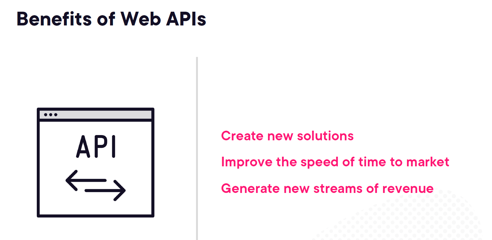
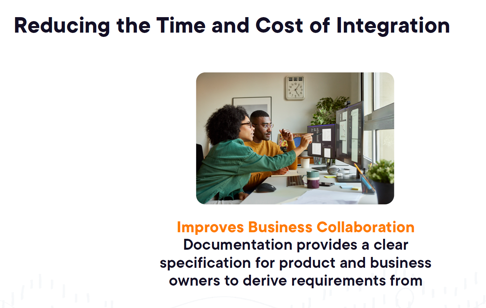

# 2. Why Is It Critical to Document APIs

- [2. Why Is It Critical to Document APIs](#2-why-is-it-critical-to-document-apis)
  - [1. Introduction](#1-introduction)
    - [1. **Effectively Documenting Your APIs**](#1-effectively-documenting-your-apis)
    - [2. **API Foundational Concepts**](#2-api-foundational-concepts)
    - [3. **Tools for Code Auto-generation and Documentation**](#3-tools-for-code-auto-generation-and-documentation)
  - [2. Version Check](#2-version-check)
  - [3. Understanding the Fundamentals of an API](#3-understanding-the-fundamentals-of-an-api)
    - [1. **What Is an API?**](#1-what-is-an-api)
    - [2. **Components of Web APIs**](#2-components-of-web-apis)
    - [3. **Domain-Driven Design (DDD)**](#3-domain-driven-design-ddd)
    - [4. **Carved Rock Fitness – Information Flow and Endpoints**](#4-carved-rock-fitness--information-flow-and-endpoints)
    - [Putting it all together with **Domain-Driven Design (DDD)**](#putting-it-all-together-with-domain-driven-design-ddd)
  - [4. What Are the Benefits of Web APIs](#4-what-are-the-benefits-of-web-apis)
    - [1. **Benefits of Web APIs**](#1-benefits-of-web-apis)
    - [2. **Carved Rock Fitness API Use Cases**](#2-carved-rock-fitness-api-use-cases)
    - [Practical Examples Across Different API Use Cases](#practical-examples-across-different-api-use-cases)
    - [**Summary of How APIs Help Carved Rock Fitness**:](#summary-of-how-apis-help-carved-rock-fitness)
  - [5. Why Must You Document Your Web APIs](#5-why-must-you-document-your-web-apis)
    - [1. **Reduces the Time and Cost of Integration**](#1-reduces-the-time-and-cost-of-integration)
      - [Specific Benefits:](#specific-benefits)
    - [2. **Promotes Reusability**](#2-promotes-reusability)
    - [3. **Improves Support and Maintainability**](#3-improves-support-and-maintainability)
      - [Specific Benefits:](#specific-benefits-1)
    - [4. **Decreases Onboarding Time of New Developers**](#4-decreases-onboarding-time-of-new-developers)
      - [Discoverability of API Functionality:](#discoverability-of-api-functionality)
    - [5. **Documentation Helps with Best Practices**](#5-documentation-helps-with-best-practices)
    - [**Conclusion**:](#conclusion)

## 1. Introduction


The images you shared relate to the effective documentation of APIs, foundational API concepts, and tools for auto-generating documentation. Let's break down each of these concepts with examples:

### 1. **Effectively Documenting Your APIs**
   - **OpenAPI Specification**: This is a standard for defining your APIs in a machine-readable format. Using OpenAPI, you can define endpoints, request/response schemas, and authentication mechanisms in a structured way.
     - *Example*: You have a RESTful API that allows users to get and post restaurant data. The OpenAPI specification would define these endpoints, the required parameters, the format of the response, and any errors that might occur.
     - YAML Example:
       ```yaml
       /restaurants:
         get:
           summary: Get a list of restaurants
           responses:
             '200':
               description: A list of restaurants
               content:
                 application/json:
                   schema:
                     type: array
                     items:
                       type: object
                       properties:
                         id:
                           type: string
                         name:
                           type: string
                         rating:
                           type: number
       ```
   - **Tooling for Code and Document Generation**: Tools like Swagger, Redoc, and others can automatically generate documentation from your OpenAPI specification. This can include generating interactive API docs where users can test the endpoints.
     - *Example*: Once you've written your OpenAPI file, Swagger UI or Redoc can generate an interactive interface where developers can explore the endpoints, see example responses, and even make requests directly from the browser.
   - **Developer Portals**: These are hubs where developers can access all API-related resources, such as documentation, SDKs, and API keys. A good developer portal makes it easy to get started with the API.
     - *Example*: Stripe's API developer portal includes extensive documentation, example code, and tools for API key management, helping developers quickly integrate payment functionalities into their applications.

### 2. **API Foundational Concepts**
   - **Request**: The client (e.g., web or mobile app) sends a request to the API endpoint. The request usually includes a method (GET, POST, etc.), headers, and sometimes a body with data.
     - *Example*: When fetching user data from an API, a GET request is made to `/users`.
       ```http
       GET /users
       Host: api.example.com
       Authorization: Bearer <token>
       ```
   - **Header**: These are key-value pairs sent in an API request or response. Headers can contain metadata like authentication tokens, content type, or rate limit information.
     - *Example*: Including a `Content-Type: application/json` header specifies that the body of the request is in JSON format.
   - **Path**: The path specifies the resource being accessed.
     - *Example*: `/api/v1/restaurants` might represent the path to retrieve restaurant data.
   - **Version**: APIs are often versioned to allow updates without breaking existing integrations.
     - *Example*: Using `/v1/` in the path ensures that any future changes to the API (like `/v2/`) don't disrupt existing clients.
   - **Response**: This is the data returned by the API after processing a request.
     - *Example*: If you query a restaurant API for details about a restaurant, the response might be in JSON format:
       ```json
       {
         "id": "123",
         "name": "ABC Restaurant",
         "rating": 4.5
       }
       ```
   - **Error Code**: API responses include status codes that tell the client whether the request was successful or not. Common codes include 200 (success), 400 (bad request), 404 (not found), and 500 (server error).
     - *Example*: A 404 error might be returned if the requested restaurant does not exist.

### 3. **Tools for Code Auto-generation and Documentation**
   - **Swagger**: Swagger is a tool that can generate interactive API documentation from an OpenAPI specification. It also allows for testing API endpoints directly in the browser.
     - *Example*: If you have defined your API in OpenAPI, you can use Swagger to generate a UI where developers can interact with the API, try out endpoints, and see real-time responses.
   - **SwaggerHub**: SwaggerHub extends Swagger by providing collaboration features, versioning, and easier sharing for teams working on API documentation.
     - *Example*: Teams working on an API can use SwaggerHub to keep track of different versions of the API and ensure that developers are working with the most up-to-date documentation.
   - **Spotify Backstage**: This is an open-source developer portal platform that allows companies to create customized documentation portals for their APIs.
     - *Example*: A company can use Backstage to create a central place where developers can find all internal and external API documentation, tools, and integration guidelines.
   - **Redoc**: Another tool that generates beautiful, customizable API documentation from OpenAPI specs.
     - *Example*: Once you’ve created an OpenAPI specification, you can use Redoc to generate sleek, human-readable documentation that’s easy to navigate.
   - **Redocly**: This is an advanced version of Redoc, which offers features like multi-language support, SEO-optimized API docs, and collaboration tools.
     - *Example*: A SaaS company can use Redocly to provide multilingual API documentation that ranks well on search engines, helping third-party developers integrate with the service.

These tools and concepts together create a complete ecosystem for documenting, generating, and managing APIs, making the life of developers and consumers easier while ensuring consistency across systems.
## 2. Version Check

## 3. Understanding the Fundamentals of an API


The images you’ve shared provide insights into several core concepts in API development and domain-driven design (DDD). I’ll explain each of them in detail, along with practical examples to demonstrate how they work.

### 1. **What Is an API?**
   - **Definition**: An API (Application Programming Interface) is essentially a contract between two software components, defining how they communicate with each other.
     - *Example*: Imagine you are building a weather app. Instead of building weather data from scratch, you can use an API like OpenWeather to get real-time data. The API defines how your app requests data (e.g., weather for a specific city) and how the weather service responds (e.g., the temperature and weather conditions).

### 2. **Components of Web APIs**
   - **Path**: The path refers to the specific endpoint on the server that the API targets.
     - *Example*: `/users` or `/products` are examples of API paths. If you want to retrieve data about a specific product in an e-commerce API, you might send a request to `/products/{productId}`.
   - **Operation**: This refers to the method (HTTP verb) you are using—such as GET (retrieve data), POST (submit data), PUT (update data), or DELETE (remove data).
     - *Example*: A `GET /users` call fetches a list of users, while a `POST /users` would create a new user in the database.
   - **Request**: This is the actual data or parameters sent in the API request.
     - *Example*: When a user logs into a website, the request might contain the username and password in the body.
   - **Version**: APIs are often versioned to ensure backward compatibility when updates are made.
     - *Example*: `/v1/products` might be version 1 of the API, while `/v2/products` would contain updated features or changes in how products are retrieved.
   - **Response Body**: This is the data returned from the API.
     - *Example*: A response might look like this for a product:
       ```json
       {
         "id": "101",
         "name": "Laptop",
         "price": 1200.99
       }
       ```
   - **Status Code**: This tells whether the request was successful or if there was an error.
     - *Example*: `200 OK` means the request was successful, while `404 Not Found` means the endpoint or resource doesn’t exist.

### 3. **Domain-Driven Design (DDD)**
   - **Definition**: DDD is a methodology for tackling complex software design by focusing on the core business logic (domain) and dividing it into bounded contexts.
     - *Example*: In an online fitness application, we might have multiple bounded contexts, such as:
       - **Customer Management Context**: Handles everything related to customer information (e.g., contacts, profiles).
       - **Product Catalog Context**: Handles fitness products (e.g., equipment, accessories).
       - **Fitness Service Context**: Manages services like workout routines and schedules.
   - **Bounded Contexts**: These are distinct areas within a domain that have clearly defined boundaries. They help isolate different business rules and make the system easier to maintain.
     - *Example*: The fitness application might split responsibilities:
       - **Customer Management Context**: Manages customers, contacts, and notes.
       - **Product Catalog Context**: Deals with products and categories.
       - **Fitness Service Context**: Manages workouts and schedules.
     Each of these contexts handles its own logic without interfering with the others.
   
### 4. **Carved Rock Fitness – Information Flow and Endpoints**
   - This example shows how different bounded contexts communicate through API endpoints.
     - *Customer Management Context*:
       - `/contact`: Handles customer contact information.
       - `/customer`: Manages the main customer data.
     - *Product Catalog Context*:
       - `/product`: Retrieves product details.
       - `/category`: Handles product categories.
     - *Fitness Service Context*:
       - `/workout`: Manages workout routines.
       - `/schedule`: Handles fitness schedules.
     - *Example*: In practice, this setup allows you to scale the system easily. If the company wants to add a new feature (like tracking nutrition), you can create a separate context for it without affecting other parts of the system.

### Putting it all together with **Domain-Driven Design (DDD)**
   - **Why Use Bounded Contexts?**: As the system grows in complexity, separating responsibilities into different contexts helps in managing the code, maintaining clear boundaries, and scaling specific areas of the software without breaking others.
   - **Example in Action**:
     - For a fitness platform, **Customer Management** would handle user registrations, updates to customer details, and communication preferences.
     - **Product Catalog** would manage all equipment or workout gear that the company sells.
     - **Fitness Service** would handle interactions related to booking fitness classes, tracking workouts, or planning schedules.
     These contexts would have their own API endpoints, ensuring clean and decoupled interactions.

These principles help maintain clarity, make it easier to maintain and scale the system, and support agile development as different parts of the API can evolve independently.


## 4. What Are the Benefits of Web APIs



The images you’ve shared highlight several key benefits and use cases of APIs, particularly for the fitness industry (Carved Rock Fitness). Let’s dive deeper into the benefits of APIs and provide examples based on the information provided.

### 1. **Benefits of Web APIs**

   - **Create New Solutions**: APIs enable developers to build new applications or enhance existing ones by integrating external services or data sources.
     - *Example*: A fitness app can use a weather API to show users the current weather conditions for outdoor workouts. By integrating a weather service API, the fitness app adds value and functionality without needing to build the weather system from scratch.
   
   - **Improve the Speed of Time to Market**: APIs allow businesses to launch products faster because they can rely on pre-existing services.
     - *Example*: Instead of building a custom payment gateway, a company can integrate a payment API like Stripe or PayPal to manage transactions. This saves time in development and allows the company to focus on its core product, thereby speeding up the release of new features.

   - **Generate New Streams of Revenue**: By exposing APIs to third parties, companies can monetize their data and services.
     - *Example*: Carved Rock Fitness could offer a subscription-based API that other fitness platforms use to access workout plans, nutrition advice, or other premium services, creating a new revenue stream.

### 2. **Carved Rock Fitness API Use Cases**

   - **Purchase Order Automation API**: This API automates the creation of purchase orders for customers.
     - *Example*: If a customer needs to place a recurring order for fitness equipment, the API can automatically generate and submit the purchase order based on predefined conditions (e.g., quantity thresholds or specific time intervals). This reduces manual work, streamlining the process and improving accuracy.
   
   - **Customer API**: Centralizes business logic and data, reducing duplication across the organization.
     - *Example*: Carved Rock Fitness might have multiple systems interacting with customer data (e.g., CRM, e-commerce). The Customer API ensures that all customer-related operations (e.g., updating contact information or order history) are centralized in one place, so there’s no redundant data or confusion between systems.
     - By centralizing customer information, any update made via the API is automatically reflected across all connected services (like the CRM or email marketing tool), ensuring consistency and reducing duplication.

   - **Workout API**: Exposes fitness content (workout plans) to third-party developers.
     - *Example*: Suppose a third-party app, like a social fitness network, wants to provide its users with high-quality workout plans. Carved Rock Fitness could provide an API allowing the app to access and display workout plans. In return, the social network expands its offering, and Carved Rock Fitness reaches a broader audience, possibly attracting new customers.

### Practical Examples Across Different API Use Cases

   1. **API for New Solutions**:  
      - A travel company could use a flight booking API to offer booking services within their platform without having to create a booking engine from scratch. Similarly, an API integration for a currency exchange service could provide live exchange rates directly in the app.
   
   2. **API for Speed to Market**:  
      - A ride-hailing app can use mapping APIs (e.g., Google Maps) for geolocation services, allowing them to focus more on the business logic and improving the user experience rather than building geolocation services from the ground up.
   
   3. **API for New Revenue Streams**:  
      - A company like Spotify can expose its music data API to developers who want to build music discovery apps, thereby expanding its ecosystem and creating additional subscription revenue by charging for API access.

### **Summary of How APIs Help Carved Rock Fitness**:
   - **Purchase Order Automation**: Reduces manual work by automating repetitive business tasks like drafting purchase orders, which increases efficiency.
   - **Customer API**: Helps ensure that customer data is centralized and consistent across all systems, reducing errors and duplication.
   - **Workout API**: Extends the company’s reach by allowing third-party developers to integrate Carved Rock Fitness workout content into their apps, potentially increasing brand visibility and generating new revenue streams.

APIs play a crucial role in today’s tech-driven businesses by making it easier to integrate, automate, and extend systems without reinventing the wheel. Would you like further clarification on any of these examples, or do you need assistance with applying APIs in a specific project?
## 5. Why Must You Document Your Web APIs





The images you uploaded focus on the **Benefits of Documenting Web APIs**, and I will explain each benefit deeply, providing relevant examples to clarify their importance.

### 1. **Reduces the Time and Cost of Integration**
   - **Explanation**: API documentation serves as a guide for developers, showing them how to interact with the API correctly. Without it, developers might have to spend considerable time understanding the API's functionality by going through the code.
   - **Example**: Imagine a third-party app integrating with the Stripe payment gateway API. Stripe's detailed documentation explains how to handle payments, subscriptions, and refunds. If this documentation were not available, developers would have to guess or explore the API’s code, which would slow down development and increase costs.

   #### Specific Benefits:
   - **Reduce Code Spelunking**: Clear API documentation means developers don't need to dive into the actual code to understand how the API works. 
     - *Example*: If the API documentation for a user authentication system is comprehensive, it will clearly explain the process of login, token generation, and validation, without requiring the developer to read through the backend logic.
   - **Improve Estimation**: Proper documentation improves the accuracy of time and effort estimation during integration.
     - *Example*: A project manager can better estimate the time required to integrate a shipping API like FedEx’s, as the documentation provides a detailed understanding of the endpoints and data structures, reducing surprises.
   - **Improves Quality**: Clear specifications lead to higher-quality integrations.
     - *Example*: A developer working with Twilio’s SMS API can ensure they are sending and receiving messages correctly because the documentation outlines best practices, error handling, and response formats.
   - **Improves Business Collaboration**: Documentation allows business owners to understand the API’s capabilities and set clear product requirements.
     - *Example*: A product owner can collaborate with the engineering team and define features based on the API documentation for Google Maps, ensuring the application meets both business and technical requirements.

### 2. **Promotes Reusability**
   - **Explanation**: APIs that are well-documented can be reused across different projects without needing major modifications, as developers can quickly understand how to leverage existing functionality.
   - **Example**: Suppose a company has an internal API for handling customer data. A mobile team, web team, and partner team can all use the same API for their respective platforms. Documentation ensures that each team knows exactly how to interact with the API, promoting reusability across the organization.

### 3. **Improves Support and Maintainability**
   - **Explanation**: Documentation acts as a reference for developers, reducing support requests and making it easier to maintain and update the API.
   - **Example**: Consider an e-commerce platform that offers an API for inventory management. If the API documentation explains the error codes (e.g., 400 for invalid data, 404 for missing resources), developers can troubleshoot issues themselves. This reduces the need for the platform's support team to answer basic questions, allowing them to focus on more complex issues.

   #### Specific Benefits:
   - **Clear Troubleshooting Steps**: Developers can quickly resolve issues because they know what each error status means and how to address it.
     - *Example*: A developer working with a REST API for a food delivery app can refer to the documentation for what to do when they encounter a "403 Forbidden" error, likely indicating missing authentication or incorrect permissions.

### 4. **Decreases Onboarding Time of New Developers**
   - **Explanation**: New developers can ramp up quickly by referring to the API documentation instead of relying on others for guidance or going through a time-consuming exploration process.
   - **Example**: When a new developer joins a team building a travel app and needs to work with a flight search API, well-documented endpoints, parameters, and example responses help them understand the system faster. Without documentation, they would need to spend additional time figuring out how the API functions.

   #### Discoverability of API Functionality:
   - **Explanation**: Documentation also helps in discovering what features are available within an API.
   - **Example**: A developer working with the Facebook Graph API can quickly discover available endpoints like fetching user posts, comments, or friends, thanks to comprehensive documentation. This allows them to take advantage of the full functionality of the API without needing insider knowledge.

### 5. **Documentation Helps with Best Practices**
   - **Explanation**: API documentation often outlines best practices for using the API, ensuring developers use it efficiently and securely.
   - **Example**: PayPal’s API documentation emphasizes security best practices, such as how to handle authentication tokens, which reduces the risk of implementing insecure solutions.

### **Conclusion**:
   Documenting APIs is crucial for reducing integration time, promoting reusability, improving maintainability, and decreasing the onboarding time for new developers. Comprehensive API documentation helps both internal teams and external developers use the API more effectively, resulting in fewer errors and better adoption of the service. It is a critical asset for any organization that wants to streamline development and improve collaboration. 

If you need further clarification or have a specific use case in mind, feel free to ask!