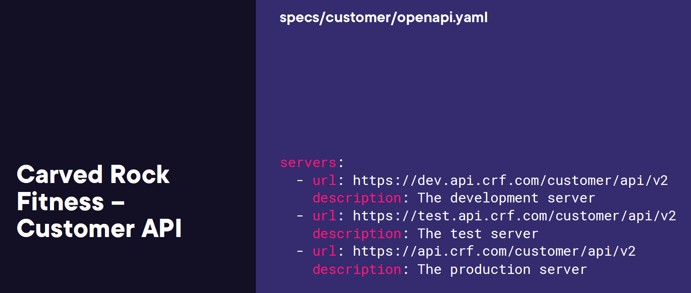

# 3. Documenting Your APIs with the OpenAPI Specification
- [3. Documenting Your APIs with the OpenAPI Specification](#3-documenting-your-apis-with-the-openapi-specification)
  - [1. Introducing the OpenAPI Specification](#1-introducing-the-openapi-specification)
  - [2. Documenting Foundational API Details](#2-documenting-foundational-api-details)
    - [Key Concepts of OpenAPI Specification (OAS 3.1.0)](#key-concepts-of-openapi-specification-oas-310)
    - [Example of an OpenAPI Definition (YAML)](#example-of-an-openapi-definition-yaml)
    - [Benefits of Using OpenAPI Specification](#benefits-of-using-openapi-specification)
    - [Detailed Breakdown of Components](#detailed-breakdown-of-components)
    - [Tooling Benefits](#tooling-benefits)
    - [Example Use Case: Developing an API for a Fitness App](#example-use-case-developing-an-api-for-a-fitness-app)
    - [Conclusion](#conclusion)
    - [1. **Basic Structure (YAML Format)**:](#1-basic-structure-yaml-format)
    - [2. **External Documentation**:](#2-external-documentation)
    - [3. **OpenAPI Specification Benefits**:](#3-openapi-specification-benefits)
    - [4. **OpenAPI and Bounded Contexts**:](#4-openapi-and-bounded-contexts)
    - [5. **Path and Operations**:](#5-path-and-operations)
    - [6. **Schemas and Models**:](#6-schemas-and-models)
    - [Conclusion:](#conclusion-1)
  - [3. Documenting API Paths and Components](#3-documenting-api-paths-and-components)
    - [Key Sections in OpenAPI Specification with Examples:](#key-sections-in-openapi-specification-with-examples)
    - [Why OpenAPI Matters](#why-openapi-matters)
    - [Conclusion](#conclusion-2)
  - [4. Documenting API Errors](#4-documenting-api-errors)
    - [1. **Error Handling in API Design**](#1-error-handling-in-api-design)
    - [2. **Standardization of Error Responses**](#2-standardization-of-error-responses)
    - [3. **Contract-First Approach to Errors**](#3-contract-first-approach-to-errors)
    - [4. **Improving API Observability**](#4-improving-api-observability)
    - [5. **Reliability of API Integration**](#5-reliability-of-api-integration)
    - [Summary](#summary)
    - [Error Handling in API Design](#error-handling-in-api-design)
    - [Example from the Image: `Carved Rock Fitness - Customer API`](#example-from-the-image-carved-rock-fitness---customer-api)
      - [Error Definitions in OpenAPI](#error-definitions-in-openapi)
      - [Path-Level Responses](#path-level-responses)
      - [Status Codes and Errors](#status-codes-and-errors)
    - [Benefits of Standardization](#benefits-of-standardization)
    - [Summary](#summary-1)
  - [5. Documenting API Versioning](#5-documenting-api-versioning)
    - [1. **Overview of OpenAPI**](#1-overview-of-openapi)
    - [2. **Key Components of OpenAPI**](#2-key-components-of-openapi)
      - [**Info Object**](#info-object)
      - [**Server Object**](#server-object)
    - [3. **Paths and Operations**](#3-paths-and-operations)
      - [Example: **Customer API Endpoint**](#example-customer-api-endpoint)
      - [Path Parameter Object](#path-parameter-object)
    - [4. **Response Objects**](#4-response-objects)
    - [5. **Schema Object**](#5-schema-object)
    - [6. **Error Handling**](#6-error-handling)
    - [7. **Versioning**](#7-versioning)
    - [8. **Benefits of OpenAPI**](#8-benefits-of-openapi)
    - [Conclusion](#conclusion-3)
  - [6. Module Summary](#6-module-summary)

## 1. Introducing the OpenAPI Specification


- [https://spec.openapis.org/oas/v3.1.0](https://spec.openapis.org/oas/v3.1.0)
- [https://github.com/pluralsight-documenting-apis/carved-rock-fitness-openapi-spec](https://github.com/pluralsight-documenting-apis/carved-rock-fitness-openapi-spec)
## 2. Documenting Foundational API Details


The OpenAPI Specification (OAS) is a standard format used to define RESTful APIs in either JSON or YAML format. It provides a structured way for developers to describe all aspects of their APIs, from endpoints and parameters to request/response formats, making it easier to develop, integrate, and maintain APIs.

### Key Concepts of OpenAPI Specification (OAS 3.1.0)

According to the OpenAPI 3.1.0 specification, which can be found [here](https://spec.openapis.org/oas/v3.1.0), the primary components of an API definition include:
1. **Paths**: These define the endpoints (URIs) that an API exposes, including the available operations such as `GET`, `POST`, `PUT`, etc.
2. **Operations**: Operations represent the methods allowed on each path. Each operation specifies what requests are allowed, expected responses, and potential error codes.
3. **Components**: This section holds reusable data structures like schemas, headers, responses, parameters, and security configurations.
4. **Request/Response Bodies**: Defines the structure of requests and responses, including required fields and supported data formats.
5. **Security**: Outlines the security mechanisms like API keys, OAuth2, and other authentication methods.
6. **Servers**: Provides information about the available servers where the API is hosted.
7. **Tags**: Allows grouping of operations by category for better organization.

### Example of an OpenAPI Definition (YAML)
Here’s an example of a simple OpenAPI 3.1.0 definition in YAML format for a user management API:

```yaml
openapi: 3.1.0
info:
  title: User Management API
  description: An API for managing users in an application.
  version: 1.0.0
servers:
  - url: https://api.example.com/v1
paths:
  /users:
    get:
      summary: Get all users
      operationId: getUsers
      responses:
        '200':
          description: A list of users
          content:
            application/json:
              schema:
                type: array
                items:
                  $ref: '#/components/schemas/User'
  /users/{userId}:
    get:
      summary: Get a user by ID
      parameters:
        - name: userId
          in: path
          required: true
          schema:
            type: string
      responses:
        '200':
          description: User details
          content:
            application/json:
              schema:
                $ref: '#/components/schemas/User'
components:
  schemas:
    User:
      type: object
      properties:
        id:
          type: string
        name:
          type: string
        email:
          type: string
```

### Benefits of Using OpenAPI Specification

1. **APIs Are Easier to Develop**:
   - **Benefit**: Developers can clearly see how APIs are expected to behave, reducing ambiguity during development.
   - **Example**: When building a new endpoint for a food delivery service, the OpenAPI specification can define the required parameters, the structure of the response (e.g., delivery status, estimated time), and possible error responses (e.g., "404 Not Found" if the order ID is invalid).

2. **APIs Are Easier to Integrate**:
   - **Benefit**: OpenAPI documentation allows external developers to understand how to interact with your API without needing to dive into your code or ask many questions.
   - **Example**: A third-party service wanting to integrate with a payment gateway API can use the OpenAPI definition to see what the required authentication mechanisms are, the available endpoints (e.g., for creating a transaction), and how errors (e.g., insufficient funds) are handled.

### Detailed Breakdown of Components

1. **Paths**: The `paths` section allows developers to define various API endpoints.
   - **Example**: `/users/{userId}` describes how a client can retrieve a specific user by providing a user ID in the request. This clearly defines how to fetch individual resources (users in this case) and what kind of response can be expected.

2. **Request Parameters**: These define the inputs that an endpoint accepts, either through query parameters or within the body.
   - **Example**: If a shopping API includes a `/products` endpoint, parameters like `category` or `price` could be added as query parameters. The OpenAPI spec ensures that every consumer knows what is required or optional for requests.

3. **Reusable Components**: By defining reusable components (e.g., schemas), OpenAPI makes it easy to maintain consistency across an API and simplifies updates.
   - **Example**: In the user management API above, the `User` schema can be reused across multiple endpoints. This means the API doesn’t have to redefine the structure of a `User` object for every request or response, thus improving consistency.

4. **Security Definitions**: OpenAPI supports defining authentication methods, such as API keys or OAuth.
   - **Example**: For an e-commerce API, OpenAPI can specify the security scheme, such as requiring a JWT token for accessing any endpoints related to order management (e.g., `/orders/{orderId}`), ensuring that clients know how to authenticate correctly.

### Tooling Benefits
Using OpenAPI also allows for auto-generating API documentation and client libraries:

1. **Swagger UI**:
   - **Benefit**: Automatically generates a user-friendly interface where developers can interact with your API (e.g., try out endpoints and see real-time responses).
   - **Example**: If a weather service provides an OpenAPI definition, Swagger UI will allow developers to make sample requests for weather forecasts, testing different parameters (like location or date) directly from their browser.

2. **Client SDKs**:
   - **Benefit**: Many tools can automatically generate SDKs in various programming languages (e.g., Python, JavaScript) based on an OpenAPI definition, saving developers time and reducing errors.
   - **Example**: A company that provides a sports API for tracking game scores can generate SDKs for Android and iOS developers, ensuring they all use the same structured method to access the API’s functionality.

### Example Use Case: Developing an API for a Fitness App

Let's say you're building a fitness app that exposes APIs for managing workouts and user progress. Using the OpenAPI 3.1.0 specification, you could define the following paths:

```yaml
openapi: 3.1.0
info:
  title: Fitness Tracker API
  version: 1.0.0
paths:
  /workouts:
    get:
      summary: Get all workouts
      responses:
        '200':
          description: A list of workouts
          content:
            application/json:
              schema:
                type: array
                items:
                  $ref: '#/components/schemas/Workout'
  /workouts/{workoutId}:
    get:
      summary: Get workout details
      parameters:
        - name: workoutId
          in: path
          required: true
          schema:
            type: string
      responses:
        '200':
          description: Workout details
          content:
            application/json:
              schema:
                $ref: '#/components/schemas/Workout'
components:
  schemas:
    Workout:
      type: object
      properties:
        id:
          type: string
        name:
          type: string
        duration:
          type: integer
```

With this, the fitness app's API becomes easier to develop, understand, and integrate with because:
1. **APIs Are Easier to Develop**: Developers working on the fitness app backend can see exactly what information is needed to retrieve workouts, ensuring that all endpoints follow a consistent structure.
2. **APIs Are Easier to Integrate With**: External developers (e.g., third-party fitness device manufacturers) can integrate with the API to fetch workout data and sync user progress, without needing in-depth knowledge of the backend.

### Conclusion

Using the OpenAPI Specification simplifies API development and integration by providing a clear, structured format for defining APIs. It encourages consistency, reusability, and enables better collaboration between development teams. Tools like Swagger UI and client SDK generators further enhance the usability of OpenAPI by making it easier for developers to explore and interact with APIs.


The OpenAPI Specification (OAS) is a standard way to define APIs in a format that is both machine-readable and human-readable. It allows developers to specify their APIs, ensuring consistency, ease of understanding, and proper documentation. The OpenAPI Specification is primarily used to define the endpoints, operations, inputs, and outputs of a web service.

Let's break down the OpenAPI specification using examples from the images provided:

### 1. **Basic Structure (YAML Format)**:
   The OpenAPI file is commonly written in either JSON or YAML format. In the image labeled `specs/customer/openapi.yaml`, you can see the following structure:
   ```yaml
   tags:
     - name: Customers
       description: Customer resource operations
     - name: Customer Notes
       description: Customer notes resource operations
   ```
   - **Tags**: Tags help group operations by name and description. In this case, "Customers" and "Customer Notes" are two distinct groups of operations. This is helpful for organizing the API and understanding which endpoints perform what functions.

   For example, if we have a `/customers` endpoint, it would fall under the "Customers" tag, and a `/customer/notes` endpoint would fall under the "Customer Notes" tag.

### 2. **External Documentation**:
   Another key feature of OpenAPI is the ability to include external documentation. In the example:
   ```yaml
   externalDocs:
     description: Find out more about our APIs
     url: https://www.carvedrockfitness/api
   ```
   - **externalDocs**: This section provides additional references for users to learn more about the API. It points developers to external resources (like a website) where more details about the API can be found, in this case, "https://www.carvedrockfitness/api."

   This is particularly useful when developers need to consult external documentation, guides, or detailed examples about how to integrate or use the API.

### 3. **OpenAPI Specification Benefits**:
   The benefits of using OpenAPI, as seen in the image, include:
   - **Easier API development**: OpenAPI enforces a structure that ensures the API design is logical and easy to understand.
   - **Ease of integration**: Since OpenAPI is a standard, developers can use various tools (e.g., Swagger UI, Postman) to automatically generate client libraries or test APIs, reducing the manual effort required for integration.

   This ease of use is crucial when multiple teams are developing APIs or when third-party developers need to integrate with your system.

### 4. **OpenAPI and Bounded Contexts**:
   OpenAPI works well within the concept of **bounded contexts** in domain-driven design (DDD). In the `Carved Rock Fitness` example, the API is divided into different bounded contexts:
   - **Customer Management Context**: Handles operations like adding or updating customer information.
   - **Product Catalog Context**: Manages products and categories.
   - **Fitness Service Context**: Deals with workouts and schedules.

   Each context has its own API endpoints, making the design modular. For instance, the `/contact`, `/customer`, `/product`, and `/workout` endpoints are part of different contexts but all work within the larger Carved Rock Fitness application.

### 5. **Path and Operations**:
   OpenAPI allows you to specify the path, operations (like GET, POST, PUT), and responses for each API. For example, consider the `/customers` endpoint:
   ```yaml
   paths:
     /customers:
       get:
         summary: Returns a list of customers
         tags:
           - Customers
         responses:
           '200':
             description: Successful response
   ```
   - **/customers**: This is the endpoint where the API returns a list of customers.
   - **get**: The operation method (HTTP verb).
   - **summary**: A short description of what the operation does.
   - **tags**: In this case, it refers to the "Customers" group for organizational purposes.
   - **responses**: Specifies the possible outcomes of this operation. Here, `'200'` indicates a successful response.

### 6. **Schemas and Models**:
   OpenAPI lets you define the structure of the input and output data. For example, you can define a schema for the "Customer" object:
   ```yaml
   components:
     schemas:
       Customer:
         type: object
         properties:
           id:
             type: integer
           name:
             type: string
           email:
             type: string
   ```
   This schema defines that a "Customer" is an object with three properties: `id` (integer), `name` (string), and `email` (string). When a developer interacts with the `/customers` endpoint, they know that the response will follow this structure.

### Conclusion:
Using OpenAPI provides a structured, standardized way of defining, developing, and integrating APIs. It helps ensure that APIs are easier to develop and integrate with, provides clear documentation, and facilitates collaboration among developers. The OpenAPI specification's ability to define paths, operations, schemas, and even external documentation makes it an invaluable tool in modern API development.

The images provided illustrate how OpenAPI can be used to define and document a "Customer API" for Carved Rock Fitness, offering a clear example of how the specification applies to real-world APIs.


## 3. Documenting API Paths and Components


The OpenAPI Specification (OAS) provides a standard format for defining and describing REST APIs. This specification simplifies API development and integration, allowing developers to create standardized documentation for their APIs. Let's explore the elements you've shared using the official OpenAPI v3.1.0 specification as a guide.

### Key Sections in OpenAPI Specification with Examples:

1. **API Paths and Operations:**
   OpenAPI defines how API paths and operations (like GET, POST, etc.) are documented.

   Example from your images:
   ```yaml
   /customers/{customerId}:
     get:
       tags:
         - Customers
       summary: Get a customer by ID
       description: Endpoint to get a customer by ID
       operationId: getCustomerById
       parameters:
         - $ref: '#/components/parameters/CustomerIdPathParameter'
       responses:
         '200':
           description: A customer entity
           content:
             application/json:
               schema:
                 $ref: '#/components/schemas/Customer'
   ```

   - **Path**: `/customers/{customerId}` – This path includes a variable `{customerId}`, which will be replaced with an actual customer ID when the API is called.
   - **Method**: `get` – This defines an HTTP GET request for retrieving customer data by ID.
   - **Parameters**: The request includes a parameter for `customerId` specified using `$ref` to a predefined component.
   - **Response**: On success (`200` status), the API returns a customer entity in JSON format, which refers to the `Customer` schema.

   This structure defines how a client can call an endpoint to retrieve customer data. The response is clearly defined in terms of both content type (`application/json`) and schema (`Customer`).

2. **Components:**
   The OpenAPI specification uses a `components` section to define reusable objects like schemas and parameters.

   Example from your image:
   ```yaml
   components:
     parameters:
       CustomerIdPathParameter:
         name: customerId
         in: path
         description: The ID of the customer
         required: true
         schema:
           type: integer
           format: int64
           example: 12345
   ```

   - **CustomerIdPathParameter**: This component defines the `customerId` parameter. 
   - **Attributes**: 
     - `in: path` means the parameter is part of the URL path.
     - `type: integer` and `format: int64` ensure the ID is an integer of 64-bit format.
     - `example: 12345` shows an example value to help developers understand what kind of data to input.
   - **Reusability**: By defining this parameter in `components`, it can be reused across multiple API paths.

3. **Schemas:**
   OpenAPI allows you to define complex data models for your API’s input and output using JSON schema.

   Example from your image:
   ```yaml
   components:
     schemas:
       CustomerInput:
         properties:
           firstName:
             type: string
             format: string
             example: "Michael Hoffman"
       Customer:
         allOf:
           - $ref: '#/components/schemas/CustomerInput'
           - type: object
             properties:
               id:
                 type: integer
                 format: int64
                 example: 12345
             required:
               - id
   ```

   - **CustomerInput**: This schema defines input properties for a customer (in this case, a `firstName` of type `string`).
   - **Customer**: This schema is more complex. It extends `CustomerInput` using `allOf`, meaning it inherits the properties of `CustomerInput` and adds new ones like `id` (an integer).
   - **Inheritance**: `allOf` is useful when you want to extend a base schema to avoid redundancy.

4. **External Documentation:**
   The OpenAPI specification allows for external documentation to be linked, improving the discoverability of detailed API information.

   Example:
   ```yaml
   externalDocs:
     description: Find out more about our APIs
     url: https://www.carvedrockfitness/api
   ```

   - **externalDocs**: This points to additional documentation outside the OpenAPI specification file, which provides more in-depth details about the API. This is useful for large projects where some details are kept in external documents.

### Why OpenAPI Matters

- **Standardization**: OpenAPI provides a common language for API development, ensuring that documentation is clear and easy to understand for both humans and machines.
- **Automation**: Tools like Swagger and Postman can automatically generate documentation, clients, and test environments from OpenAPI files, making it easier for developers to work with APIs.
- **Validation**: Defining the structure of requests and responses helps catch errors early by validating inputs and outputs according to the schema.

### Conclusion
The OpenAPI Specification simplifies API creation, integration, and documentation. By defining paths, components, parameters, and schemas, it provides a clear, standardized way to describe API functionality. This standard makes APIs easier to integrate with and enhances collaboration between teams through well-defined interfaces.

## 4. Documenting API Errors


The OpenAPI Specification (OAS) is a widely used standard for defining and describing APIs. Version 3.1.0 brings a lot of new features and improvements. Let's break down the benefits shown in your images and explain them with examples using the OpenAPI Specification:

### 1. **Error Handling in API Design**
Error handling is a critical part of designing robust APIs. By standardizing how errors are handled and returned to clients, you can improve your API's usability, reliability, and maintainability. The OpenAPI Specification provides a way to define responses, including error responses, making it easier to maintain consistent error messages across your APIs.

**Example:**

In the OpenAPI YAML format, you can define responses for each API operation. For example, let's say you want to define a standard 404 error response for a customer lookup:

```yaml
paths:
  /customers/{customerId}:
    get:
      summary: Get a customer by ID
      parameters:
        - $ref: '#/components/parameters/customerId'
      responses:
        '200':
          description: Successfully retrieved customer
          content:
            application/json:
              schema:
                $ref: '#/components/schemas/Customer'
        '404':
          description: Customer not found
          content:
            application/json:
              schema:
                $ref: '#/components/schemas/Error'
```

Here, the `404` error response describes the situation where a customer is not found. The schema reference (`#/components/schemas/Error`) could describe a standard error message, including fields such as error code, message, and details.

### 2. **Standardization of Error Responses**
Standardization promotes consistency, which is crucial for users of your API. When error handling is standardized, developers can easily integrate with the API and expect uniform error responses across different endpoints. This also reduces the learning curve for developers and improves the observability of errors in a production environment.

**Example of Standardized Error Schema:**

```yaml
components:
  schemas:
    Error:
      type: object
      properties:
        code:
          type: integer
          example: 404
        message:
          type: string
          example: "Customer not found"
        details:
          type: string
          example: "The customer ID provided does not exist in the system"
```

By defining a reusable `Error` schema in your `components` section, you can reference it across multiple paths, ensuring that all your APIs return errors in the same format.

### 3. **Contract-First Approach to Errors**
The OpenAPI Specification supports a contract-first approach, meaning that the design of the API is defined before implementation. This ensures that clients and developers know how the API behaves—including how it handles errors—before it's even built.

In a contract-first approach, error responses are part of the API contract. For example, in the OpenAPI specification, you define errors upfront:

```yaml
openapi: 3.1.0
info:
  title: Customer API
  version: 1.0.0
paths:
  /customers/{customerId}:
    get:
      summary: Get a customer by ID
      responses:
        '200':
          description: OK
        '404':
          description: Not Found
components:
  schemas:
    Error:
      type: object
      properties:
        code:
          type: integer
        message:
          type: string
        details:
          type: string
```

### 4. **Improving API Observability**
Observability refers to how easily the behavior of your API can be understood from its outputs, particularly in error cases. If errors are well-defined in the OpenAPI spec, developers can log these standardized error messages, helping them monitor and troubleshoot issues more effectively.

**Benefits of Error Observability:**

- **Improved debugging:** Detailed error messages help pinpoint the issue.
- **Monitoring and alerts:** APIs can be monitored based on the error codes returned.
- **Consistency in logging:** Having standardized error codes and messages ensures that logs and alerts are consistent across the platform.

### 5. **Reliability of API Integration**
Reliable error handling ensures that API clients receive predictable, well-structured responses, even in error scenarios. By using OpenAPI to define and handle errors in a consistent way, developers can confidently build integrations without worrying about unexpected responses.

### Summary
Using OpenAPI Specification 3.1.0, you can:
- **Improve error insight**: Define error types clearly, including 4xx and 5xx responses.
- **Promote standardization**: Use shared schemas for error responses, making integration easier.
- **Enhance observability**: Use structured error responses that can be monitored and logged effectively.
- **Use a contract-first approach**: Design the API contract, including error handling, before implementation to ensure consistency.

These aspects help ensure your API is user-friendly, easier to integrate, and more maintainable.


In OpenAPI 3.1.0, error handling plays a crucial role in defining how the API behaves when something goes wrong. The specification allows developers to explicitly define error responses in the API contract, which brings clarity to both API users and developers. Let's break down the example you provided and elaborate on the benefits using the OpenAPI documentation structure:

### Error Handling in API Design

**Benefits:**
- **Insight into types of errors:** Clearly defines what went wrong during a request.
- **Standardization of error responses:** Ensures that all errors are handled consistently across different endpoints.
- **Improved delivery and reliability:** Promotes a better user experience by providing actionable error information.
- **Enhanced API observability:** Makes debugging and monitoring easier by giving developers insight into failures.

---

### Example from the Image: `Carved Rock Fitness - Customer API`

#### Error Definitions in OpenAPI
Here’s an example of how errors are defined in the API specification:

```yaml
components:
  responses:
    NotFoundResponse:
      description: The requested resource was not found
      content:
        application/json:
          example:
            message: Not found
            status: 404
            error: Not found
```

This response component defines the structure of the error when the requested resource cannot be found (HTTP 404). This makes the API self-documenting, as consumers can refer to the specification and understand that when they receive a `404` status, the resource is missing.

#### Path-Level Responses
For each API endpoint, like the one provided for fetching a customer by ID, OpenAPI allows you to define specific error responses for that operation.

```yaml
paths:
  /customers/{customerId}:
    get:
      summary: Get a customer by ID
      responses:
        '200':
          description: A customer entity
        '404':
          $ref: '#/components/responses/NotFoundResponse'
```

In this path, the API specifies that if a customer is not found, a `404` error will be returned, referencing the `NotFoundResponse` defined in `components`. This modular approach reduces duplication and maintains consistency across the entire API. Additionally, the success response (HTTP 200) returns a customer entity.

#### Status Codes and Errors
Status codes like `400`, `404`, `500`, etc., are clearly defined in the API to standardize the responses. The table in the YAML file outlines common HTTP status codes:

```yaml
| **Status Code** | **Description**          |
|-----------------|--------------------------|
| 400             | Bad request               |
| 401             | Unauthorized request      |
| 404             | Not found                 |
| 409             | Conflict                  |
| 500             | Internal server error     |
```

This helps API consumers understand the possible error outcomes, such as:
- `400`: There is an issue with the client request.
- `401`: The request is unauthorized.
- `404`: The requested resource was not found.

### Benefits of Standardization

1. **Error Handling Across Endpoints:** Since the error responses are centralized in the `components` section, you can easily reuse them across multiple endpoints, ensuring consistency.
2. **Easier Debugging and Development:** Developers can immediately identify what went wrong by referring to well-defined error messages.
3. **Contract-First Approach:** API consumers know exactly what error formats to expect, which is vital in error-prone environments like production systems.
4. **API Reliability:** Well-documented errors improve API reliability by preventing ambiguous failures. Developers can quickly respond to specific errors and improve the resilience of their integration.

---

### Summary
The OpenAPI 3.1.0 specification promotes detailed error handling, enhancing the reliability and clarity of APIs. The examples provided in the `Carved Rock Fitness - Customer API` YAML file illustrate how you can define various error responses like `404 - Not Found` or `401 - Unauthorized`. By centralizing error definitions in the `components` section and referencing them in API paths, the specification ensures consistent behavior, improves the API’s usability, and enhances observability.

For further exploration, the full specification can be found at [OpenAPI 3.1.0 Documentation](https://spec.openapis.org/oas/v3.1.0).


## 5. Documenting API Versioning



The **OpenAPI Specification (OAS)** provides a structured framework for defining RESTful APIs, which is beneficial for both API designers and developers. Let’s explore OAS deeply, focusing on its core concepts and how it applies to real-world API design.

### 1. **Overview of OpenAPI**
The OpenAPI Specification is a language-agnostic, standard format for documenting APIs. It allows developers to describe the structure, capabilities, and behavior of an API in a standardized manner using JSON or YAML. Tools can automatically generate code, documentation, and tests from these specifications.

### 2. **Key Components of OpenAPI**
Here are some key components of OpenAPI, with examples from the images you’ve shared:

#### **Info Object**
Provides metadata about the API.
```yaml
info:
  title: Carved Rock Fitness Customer API
  summary: Customer API endpoints for Carved Rock
  description: |
    ## Versions
    The following are the Customer API versions:
    | **Version** | **Description** |
    | v1          | Initial release |
    | v2          | New caching approach |
  version: v2
```
**Explanation**: The `info` object contains the title, version, and description of the API. It tells the consumer what the API is about and its current version.

#### **Server Object**
Defines the servers available for the API.
```yaml
servers:
  - url: https://dev.api.crf.com/customer/api/v2
    description: The development server
  - url: https://test.api.crf.com/customer/api/v2
    description: The test server
  - url: https://api.crf.com/customer/api/v2
    description: The production server
```
**Explanation**: The `servers` object lists the various environments where the API is hosted (development, testing, and production), enabling developers to interact with different stages of the API.

### 3. **Paths and Operations**
Each endpoint in an API is defined in a path object, with operations like `GET`, `POST`, etc.

#### Example: **Customer API Endpoint**
```yaml
/customers/{customerId}:
  get:
    tags:
      - Customers
    summary: Get a customer by ID
    description: Endpoint to get a customer by ID
    operationId: getCustomerById
    parameters:
      - $ref: '#/components/parameters/CustomerIdPathParameter'
    responses:
      '200':
        description: A customer entity
        content:
          application/json:
            schema:
              $ref: '#/components/schemas/Customer'
```
**Explanation**: The above defines a `GET` operation on `/customers/{customerId}` to retrieve customer information based on the ID provided in the path. It references the `CustomerIdPathParameter` to specify the expected ID.

#### Path Parameter Object
```yaml
components:
  parameters:
    CustomerIdPathParameter:
      name: customerId
      in: path
      description: The ID of the customer
      required: true
      schema:
        type: integer
        format: int64
        example: 12345
```
**Explanation**: This parameter defines a required `customerId` path parameter of type `integer` to be used in the endpoint `/customers/{customerId}`.

### 4. **Response Objects**
Define how the API responds to requests.
```yaml
components:
  responses:
    NotFoundResponse:
      description: The requested resource was not found
      content:
        application/json:
          example:
            message: Not found
            status: 404
            error: Not found
```
**Explanation**: This response object defines a 404 error response that might be returned when the requested resource is not found.

### 5. **Schema Object**
Schemas define the structure of data returned or expected by an API.

```yaml
components:
  schemas:
    Customer:
      type: object
      properties:
        id:
          type: integer
          format: int64
          example: 12345
        firstName:
          type: string
          format: string
          example: "Michael"
```
**Explanation**: This schema defines what a customer entity looks like with fields `id` (integer) and `firstName` (string).

### 6. **Error Handling**
Error responses can be standardized across endpoints, promoting consistency.
```yaml
info:
  title: Carved Rock Fitness Customer API
  summary: Customer API endpoints for Carved Rock
  description: |
    ## Errors
    The API uses a standard set of error responses to indicate when a request has failed.
    | **Status Code** | **Description** |
    | 400             | Bad request     |
    | 401             | Unauthorized request |
    | 404             | Not found       |
    | 500             | Internal server error |
```
**Explanation**: The API documentation lists common error responses, such as `400`, `401`, `404`, and `500`, with descriptions to provide clarity on why an error occurs.

### 7. **Versioning**
APIs evolve over time, and versioning ensures backward compatibility.
```yaml
info:
  version: v2
  description: |
    ## Versions
    The following are the Customer API versions:
    | **Version** | **Description** |
    | v1          | Initial release |
    | v2          | New caching approach |
```
**Explanation**: The `version` property tracks the current version of the API, while the description explains what each version includes. Here, `v1` was the initial release, and `v2` introduces a new caching approach.

### 8. **Benefits of OpenAPI**
- **Contract-First Development**: The specification acts as a contract, ensuring all developers and consumers agree on how the API should behave.
- **Automated Documentation**: Tools can auto-generate documentation, tests, and client libraries from the OpenAPI document.
- **Version Control**: The specification supports versioning to manage API updates smoothly.

### Conclusion
The OpenAPI Specification provides a comprehensive framework for defining APIs, promoting standardization and efficiency. Through the various components (paths, schemas, parameters, and responses), it ensures consistency in API behavior and fosters collaboration between API providers and consumers.

## 6. Module Summary

