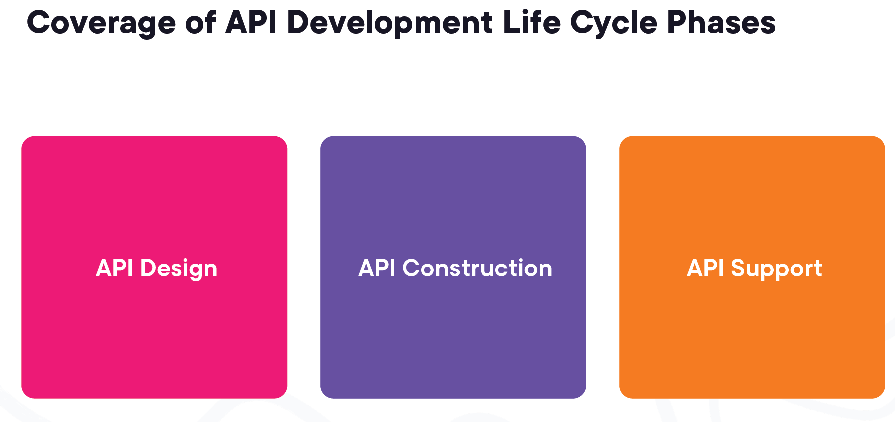
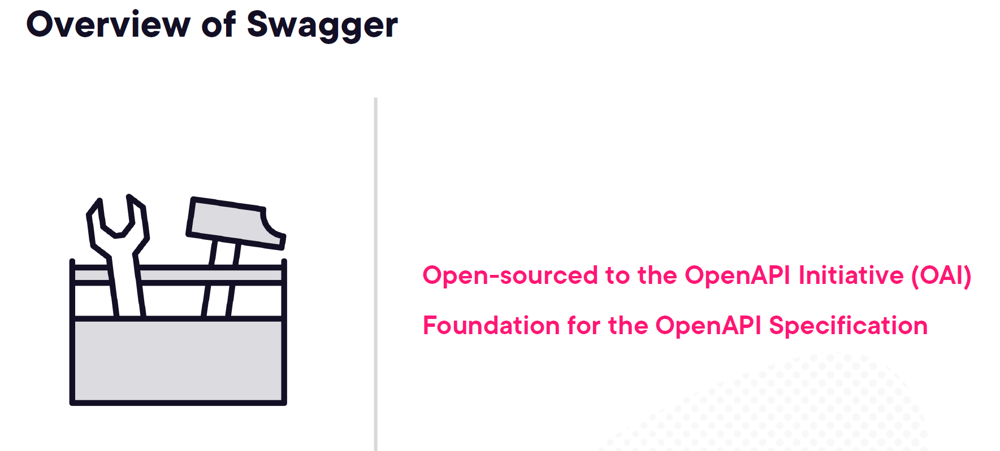
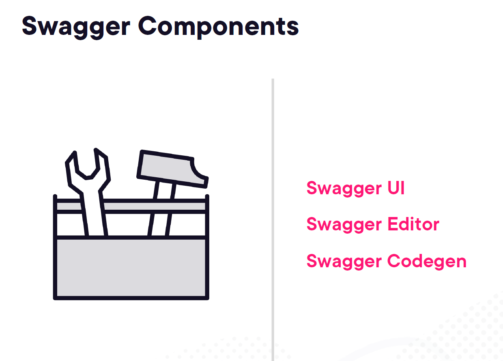
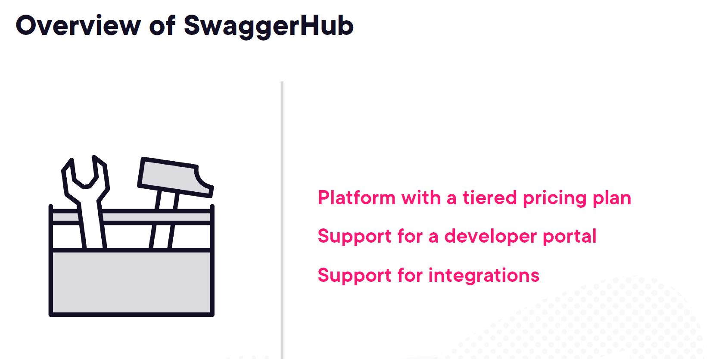
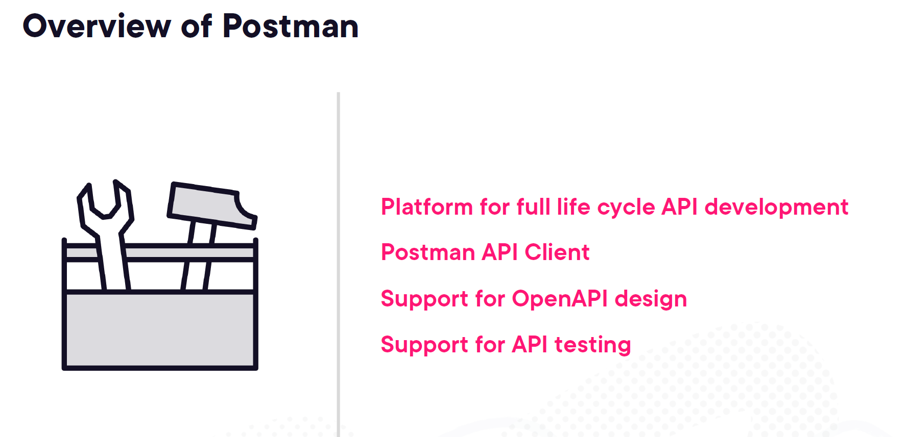
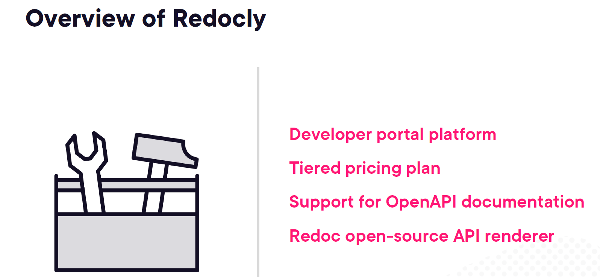
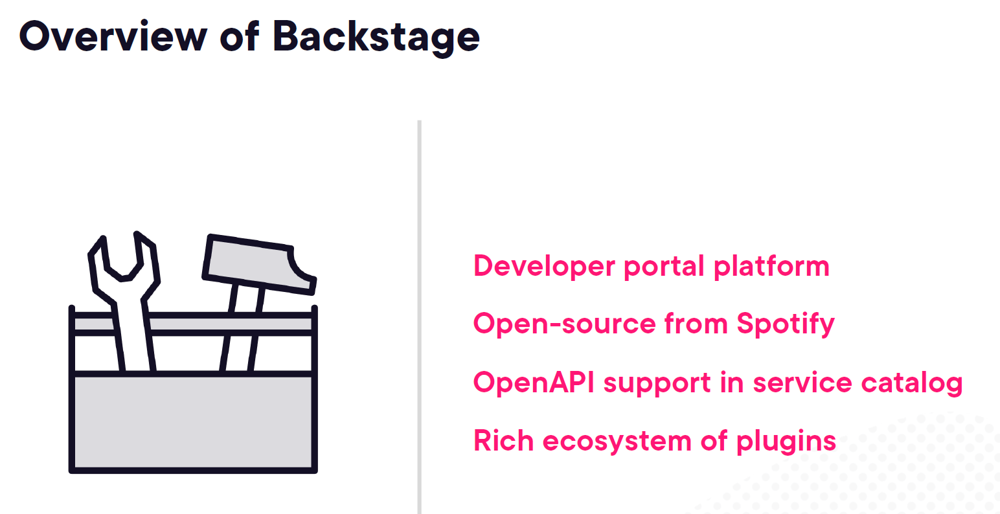

# 4. Using Tooling with the OpenAPI Specification

- [4. Using Tooling with the OpenAPI Specification](#4-using-tooling-with-the-openapi-specification)
  - [1. Understanding the OpenAPI Tooling Landscape](#1-understanding-the-openapi-tooling-landscape)
    - [1. **API Design**](#1-api-design)
      - [Key Elements of API Design:](#key-elements-of-api-design)
      - [Example:](#example)
    - [2. **API Construction**](#2-api-construction)
      - [Key Elements of API Construction:](#key-elements-of-api-construction)
      - [Example:](#example-1)
    - [3. **API Support**](#3-api-support)
      - [Key Elements of API Support:](#key-elements-of-api-support)
      - [Example:](#example-2)
    - [Conclusion:](#conclusion)
  - [2. Swagger Overview](#2-swagger-overview)
    - [Overview of Swagger:](#overview-of-swagger)
    - [Core Components of Swagger:](#core-components-of-swagger)
    - [SwaggerHub:](#swaggerhub)
    - [Example API Design Using Swagger:](#example-api-design-using-swagger)
    - [API Lifecycle with Swagger:](#api-lifecycle-with-swagger)
  - [3. Postman Overview](#3-postman-overview)
    - [Key Features of Postman:](#key-features-of-postman)
    - [Postman API Client:](#postman-api-client)
    - [Postman Collections and Workflows:](#postman-collections-and-workflows)
    - [Automated API Testing:](#automated-api-testing)
    - [API Mocking:](#api-mocking)
    - [API Monitoring:](#api-monitoring)
    - [Collaborating in Teams:](#collaborating-in-teams)
    - [Conclusion:](#conclusion-1)
  - [4. Redocly Overview](#4-redocly-overview)
    - [1. Developer Portal Platform](#1-developer-portal-platform)
    - [2. Tiered Pricing Plan](#2-tiered-pricing-plan)
    - [3. Support for OpenAPI Documentation](#3-support-for-openapi-documentation)
    - [4. Redoc Open-Source API Renderer](#4-redoc-open-source-api-renderer)
    - [Advanced Features and Integrations:](#advanced-features-and-integrations)
    - [Conclusion:](#conclusion-2)
  - [5. Backstage Overview](#5-backstage-overview)
    - [1. Developer Portal Platform](#1-developer-portal-platform-1)
    - [2. Open-source from Spotify](#2-open-source-from-spotify)
    - [3. OpenAPI Support in Service Catalog](#3-openapi-support-in-service-catalog)
    - [4. Rich Ecosystem of Plugins](#4-rich-ecosystem-of-plugins)
    - [Benefits of Using Backstage](#benefits-of-using-backstage)
    - [Conclusion](#conclusion-3)


## 1. Understanding the OpenAPI Tooling Landscape

The API development life cycle consists of three key phases: **API Design**, **API Construction**, and **API Support**. These phases ensure that APIs are effectively designed, built, and maintained over time. Let’s dive into each phase with in-depth explanations and examples.

### 1. **API Design**
This is the first step where the API's blueprint is created. It involves planning how the API will function, its structure, the endpoints, the request/response models, authentication, error handling, and more. During this phase, the OpenAPI Specification (OAS) plays a critical role as it provides a framework to define the API’s behavior in a consistent format (either JSON or YAML).

#### Key Elements of API Design:
- **Defining Endpoints**: The API endpoints, such as `/customers/{customerId}`, are planned to determine how users will interact with the API.
- **Request/Response Models**: The structure of the request body and response is outlined. For example, the schema for a customer entity in an API can look like this:
  ```yaml
  components:
    schemas:
      Customer:
        type: object
        properties:
          id:
            type: integer
            format: int64
            example: 12345
          firstName:
            type: string
            example: "John"
  ```

#### Example: 
If you are designing an API for an e-commerce platform, you would design routes such as:
- **GET** `/products`: To fetch the list of products
- **POST** `/orders`: To create a new order

During this phase, it's important to define how errors are handled:
```yaml
components:
  responses:
    NotFoundResponse:
      description: The requested resource was not found
      content:
        application/json:
          example:
            message: Not found
            status: 404
            error: Not found
```

### 2. **API Construction**
Once the design is complete, the next step is construction or development. This phase involves implementing the designed API using appropriate backend technologies, frameworks, and database systems. Developers create the code that brings the API design to life, including the logic for handling requests, querying databases, and returning responses.

#### Key Elements of API Construction:
- **Implementing Endpoints**: Developers write the code for each API endpoint. For example, if using a framework like Express.js in Node.js:
  ```javascript
  app.get('/customers/:customerId', (req, res) => {
    const customerId = req.params.customerId;
    // Logic to get customer details by ID
    res.json({ id: customerId, firstName: "John" });
  });
  ```
- **Connecting to a Database**: This phase involves setting up a connection to a database to fetch or store data. For example, using an ORM (Object-Relational Mapping) tool like Sequelize to interact with a PostgreSQL database.

#### Example:
For an API like **GET `/products/{productId}`**, you will:
- Write the backend code to handle the request and fetch the product details.
- Ensure the response matches the schema defined during the design phase.

In addition, you need to ensure that the API can handle different scenarios, including error handling (e.g., product not found returns a 404).

### 3. **API Support**
After the API is live, it enters the support phase. This involves monitoring, maintaining, and improving the API over time. It includes fixing bugs, optimizing performance, adding new features, and managing versioning.

#### Key Elements of API Support:
- **Versioning**: It’s common for APIs to go through updates without breaking existing functionality. You can release new versions of the API while continuing to support older versions:
  ```yaml
  info:
    version: v2
    description: |
      The following are the Customer API versions:
      | **Version** | **Description** |
      | v1          | Initial release |
      | v2          | New caching approach |
  ```

- **Monitoring and Logging**: API performance and usage metrics are tracked. This could include response times, error rates, and user access patterns.
- **Deprecating Features**: Over time, certain API features may become obsolete and need to be removed. It's important to notify users ahead of time before deprecating features.

#### Example:
If an e-commerce API introduces a new feature in version 2, such as advanced search filtering, you need to ensure that older versions (v1) still work while encouraging users to upgrade to the newer version. Proper documentation is critical at this stage, informing users about version changes and any potential breaking changes.

### Conclusion:
The **API development life cycle** ensures that APIs are thoroughly planned, efficiently built, and properly maintained. By breaking down the process into the phases of **Design**, **Construction**, and **Support**, developers can create robust and scalable APIs that are easy to maintain and extend as requirements change.
## 2. Swagger Overview




- [https://swagger.io/](https://swagger.io/)

Swagger is a suite of tools for implementing the OpenAPI Specification (OAS) that helps developers design, build, document, and consume REST APIs. It provides several components like **Swagger UI**, **Swagger Editor**, and **Swagger Codegen**, which together streamline the entire API development lifecycle from design to deployment. Here’s a breakdown of its core elements and how it supports API development.

### Overview of Swagger:
Swagger was originally developed by SmartBear and later donated to the **OpenAPI Initiative (OAI)**. The goal was to standardize RESTful API documentation using the OpenAPI Specification, providing a uniform format for describing REST APIs in a way that is understandable by humans and machines.

### Core Components of Swagger:
1. **Swagger UI**:
   - **What it does**: This tool allows you to visualize and interact with your API's resources directly from the browser. It helps developers understand the available endpoints, request types, and responses.
   - **Example**: You can see all available operations like `GET`, `POST`, etc., for a user API. For instance, in an API to get user details, Swagger UI allows developers or even end users to interact with the endpoint, send sample requests, and view the response in real-time.

2. **Swagger Editor**:
   - **What it does**: It's an in-browser editor that lets you create or edit your API’s OAS definition files. You can write the API schema in JSON or YAML format and see the rendered API documentation in real-time.
   - **Example**: If you're designing a customer API that allows fetching customer data using their ID, Swagger Editor provides a space to write and visualize the API structure, including endpoints, responses, request types, etc.

3. **Swagger Codegen**:
   - **What it does**: It automatically generates client libraries, server stubs, API documentation, and more, from an OpenAPI Specification.
   - **Example**: If you’ve written an API for managing orders, you can generate client SDKs in different programming languages like Python, Java, or Node.js, making it easier for developers to integrate with your API.

### SwaggerHub:
While Swagger is open-source, **SwaggerHub** is a commercial platform built on top of Swagger. It adds features such as version control, team collaboration, and integration with other development tools. Here's what it offers:
   - **Developer portal**: Allows a collaborative platform where teams can design and document APIs together.
   - **Integrations**: It supports integrations with CI/CD tools, issue trackers, and more, to help in the API development lifecycle.

### Example API Design Using Swagger:
Let’s take an example of a basic **Customer API** that fetches customer details using a customer ID:

1. **Swagger Editor**:
   You can define the endpoint `/customers/{customerId}` in the editor using YAML or JSON format.

   ```yaml
   /customers/{customerId}:
     get:
       summary: Get customer by ID
       parameters:
         - in: path
           name: customerId
           required: true
           schema:
             type: string
           description: The ID of the customer to retrieve
       responses:
         '200':
           description: A customer object
           content:
             application/json:
               schema:
                 $ref: '#/components/schemas/Customer'
         '404':
           description: Customer not found
   ```

2. **Swagger UI**:
   The above definition can be rendered using **Swagger UI**, which will show the available operations, request parameters, and response codes. You can test the API directly by entering a customer ID in the path, sending a request, and getting the response in JSON format.

### API Lifecycle with Swagger:
1. **API Design**:
   Swagger helps in the design phase by letting developers create a structured format of how the API endpoints will work, what kind of data will be input/output, and what responses and errors to expect.

2. **API Construction**:
   Swagger Codegen assists in generating code stubs that developers can use to start the construction process quickly. For example, if you’ve designed a `/products` API to fetch products, Codegen can create client libraries or server stubs, saving development time.

3. **API Support**:
   Through tools like SwaggerHub, you can monitor, maintain, and version your API, ensuring long-term stability and backward compatibility as your API evolves.

By using Swagger in conjunction with the **OpenAPI Specification**, you ensure that your APIs are not only well-documented but also easy to integrate, version, and maintain across multiple platforms.
## 3. Postman Overview

[https://www.postman.com/](https://www.postman.com/)
Postman is a platform that simplifies API development by providing a suite of tools to cover the entire API lifecycle, including design, testing, documentation, and monitoring. It is widely used to test REST APIs, but its features extend beyond that to handle all aspects of API development. Let’s dive deep into each aspect of Postman and its usage, with examples.

### Key Features of Postman:

1. **Platform for Full Life Cycle API Development**:
   Postman is more than just an API testing tool; it offers end-to-end API lifecycle management. It allows teams to collaborate on API development from design to production, integrating with CI/CD pipelines and enabling versioning and monitoring.

   - **Example**: Imagine you're working on a complex API with multiple endpoints for a social media platform. You can define these APIs, create tests for them, and collaborate with your team in real-time. Postman helps you manage the versioning of these APIs as you iterate and release new versions.

2. **Postman API Client**:
   The Postman API Client is the core of Postman’s functionality, allowing you to test API endpoints interactively. You can create requests, add headers, set authentication parameters, and send data in various formats (e.g., JSON, XML) with a simple interface.

   - **Example**: You are building an API that returns user profiles from a database. Using the Postman client, you can create a `GET` request to the `/users/{userId}` endpoint, send test data (userId), and see the API response in real time. You can also inspect headers, responses, and even cookies, helping you debug faster.

3. **Support for OpenAPI Design**:
   Postman supports OpenAPI specifications, allowing developers to import or export API schemas in the OpenAPI format. This integration helps align API design with industry standards, ensuring consistent documentation and better developer experiences.

   - **Example**: If you are working on an API project and have an OpenAPI (OAS) file defining the API, you can import this file into Postman. It will automatically create collections based on the OpenAPI spec, providing you with a working API setup that’s ready for testing and sharing with your team.

4. **Support for API Testing**:
   Postman makes testing APIs easy with its testing framework. You can write JavaScript test scripts that run automatically after making a request. Postman also supports collections for grouping API requests and allows setting up automated tests that run sequentially across these requests.

   - **Example**: For an API that retrieves products, you can create a test suite in Postman that automatically checks the response body to ensure it contains the correct product details. You can also validate status codes, response times, and headers using Postman’s built-in testing features.

### Postman API Client:
The client interface is intuitive and user-friendly, allowing developers to send requests to an API and inspect the responses. You can:
   - Set query parameters
   - Send `GET`, `POST`, `PUT`, `DELETE`, etc., requests
   - Include headers, authorization, and body data
   
   **Example Use Case**: Let’s say you are developing a product catalog API. You want to test the `POST` request to add a new product. Using Postman, you can create a `POST` request to `/products`, add a JSON body like:
   ```json
   {
     "name": "Smartphone",
     "price": 699.99,
     "stock": 100
   }
   ```
   Postman will show the API's response in real time, letting you know if the request was successful or if there are any errors.

### Postman Collections and Workflows:
You can group related API requests into collections, making it easier to test a complete workflow. Postman supports creating tests that execute a series of requests in a defined order, simulating real-world API use cases.

   **Example**: For a user authentication system, you might have requests for signing up a user, logging in, and retrieving user details. You can group these into a collection and create a workflow where:
   1. A `POST` request signs up a user.
   2. A `POST` request logs in the user, capturing the token from the login response.
   3. A `GET` request retrieves the user’s profile using the token for authorization.

### Automated API Testing:
Postman supports automated testing through scripts written in JavaScript. You can set up test cases to verify the response, check the status code, validate response times, and more.

   **Example**: After making a request to retrieve a product, you can create a test script to verify that the response contains the expected product data.
   ```javascript
   pm.test("Product name is correct", function () {
       var jsonData = pm.response.json();
       pm.expect(jsonData.name).to.eql("Smartphone");
   });
   pm.test("Status code is 200", function () {
       pm.response.to.have.status(200);
   });
   ```

### API Mocking:
Postman allows you to create mock servers for your APIs, simulating endpoints even before they are fully implemented. This enables frontend and backend teams to work in parallel.

   **Example**: If your backend is not yet ready for a `/payments` API, you can set up a mock server in Postman with expected responses. Your frontend team can then work with this mock API to develop the UI for processing payments while waiting for the backend to be completed.

### API Monitoring:
Postman provides monitoring tools to continuously test APIs, ensuring they remain functional over time. You can schedule tests to run at regular intervals and get notified if something breaks.

   **Example**: For a payment API, you can set up a monitor that runs every hour. If the API starts returning 500 errors due to server issues, Postman will notify you immediately, allowing you to take corrective action before your users are impacted.

### Collaborating in Teams:
Postman allows you to share collections, environments, and APIs with your team members. You can collaborate in real-time, leaving comments, reviewing changes, and even using version control for API collections.

   **Example**: You are working with a team to build a logistics API for tracking orders. Each team member can have access to the API’s Postman workspace, sharing test cases, making updates, and commenting on changes. This improves collaboration and accelerates development.

### Conclusion:
Postman is more than just an API testing tool; it is a complete platform for API development that supports the entire lifecycle from design, testing, and documentation to monitoring. By integrating Postman into your API development process, you ensure better collaboration, continuous testing, and ultimately, more reliable APIs. The platform’s support for OpenAPI design, automation, and collaboration makes it an essential tool for modern API development.

## 4. Redocly Overview


[https://redocly.com/](https://redocly.com/)

Redocly is a powerful platform that enhances the process of API documentation and developer portal creation. It is built around OpenAPI specifications and aims to help teams deliver better API experiences. The key features of Redocly include its developer portal platform, tiered pricing plans, support for OpenAPI documentation, and Redoc (an open-source API renderer). Let’s dive deeper into these features, using real-world examples to illustrate their usefulness.

### 1. Developer Portal Platform
Redocly provides a developer portal platform that allows teams to create and manage API documentation in a way that is both user-friendly and professional. This platform supports customized branding, giving companies the ability to design portals that fit their visual identity while providing comprehensive and interactive API documentation.

- **Example**: Let’s say you're an e-commerce company with multiple APIs (e.g., for payment processing, inventory management, and shipping). Redocly’s developer portal allows you to create a unified and branded portal where third-party developers can view all the API documentation, try out the APIs, and get the necessary keys and support to integrate your services into their applications. This improves the developer experience and ensures that your API is easy to understand and integrate.

### 2. Tiered Pricing Plan
Redocly offers tiered pricing plans that cater to different levels of API documentation needs. Whether you're a small startup or an enterprise-level company, Redocly provides pricing options that allow you to scale as your API ecosystem grows. The platform offers features such as unlimited users, multiple APIs, role-based access control, and more based on the plan.

- **Example**: A small startup launching its first API may choose a lower-tier plan that provides essential features like OpenAPI documentation rendering. As the business grows and they release more APIs, they can scale up to a higher-tier plan that includes developer portals, API versioning, and more extensive support.

### 3. Support for OpenAPI Documentation
Redocly fully supports OpenAPI (formerly known as Swagger) documentation, allowing teams to generate beautiful, interactive API docs directly from their OpenAPI specifications. This means that you can provide not just static documentation, but live examples, code snippets, and automatic testing of API requests, all integrated within the documentation.

- **Example**: You have an API that allows users to retrieve weather data for a particular location. By providing an OpenAPI specification for this API, Redocly allows you to create documentation that includes:
  - A detailed explanation of the API's parameters (e.g., location, date)
  - Example requests and responses
  - A "try it out" feature where developers can input their own parameters and test the API directly in the browser
  This live interaction with the API documentation helps developers understand how to use your API more effectively.

### 4. Redoc Open-Source API Renderer
One of the most well-known features of Redocly is **Redoc**, its open-source API renderer. Redoc allows you to render OpenAPI specifications as interactive documentation that is user-friendly and visually appealing. The tool is designed to be fully customizable, enabling you to tweak the layout, colors, fonts, and more to match your company’s branding.

- **Example**: A company providing an API for healthcare services wants their documentation to be simple and easy to navigate for developers. Using Redoc, they can customize the layout to prioritize certain endpoints, include live request/response examples, and ensure that the documentation works across devices. The clean and organized layout improves the user experience and helps third-party developers integrate healthcare services more easily.

### Advanced Features and Integrations:
Redocly also provides several advanced features that go beyond basic API documentation:
1. **Versioning Support**: Redocly supports versioning for APIs, allowing you to document different versions of your API in the same portal. This is crucial for developers who may need to reference older versions while working on legacy systems.
  
2. **Security and Access Control**: Redocly provides role-based access control, ensuring that only authorized users can view certain parts of the documentation. This is useful for internal APIs or when dealing with sensitive data.

3. **Integrations**: Redocly integrates seamlessly with several tools commonly used in the API development lifecycle, including CI/CD pipelines, testing tools, and version control systems. This allows you to automate the process of updating your API documentation as your API evolves.

- **Example**: A financial services company has several internal APIs for managing transactions, user authentication, and reporting. These APIs are only accessible to internal teams, and Redocly provides role-based access control so that only employees in the finance and IT departments can view and use the documentation. This ensures that sensitive API details remain secure while still providing a collaborative platform for internal development.

### Conclusion:
Redocly is a comprehensive platform for creating, managing, and delivering top-tier API documentation. Whether you’re using it to build a public developer portal or maintain internal documentation for your company’s APIs, Redocly’s support for OpenAPI specs, role-based access, and seamless integrations make it a powerful tool in the API development lifecycle.

By combining the open-source power of **Redoc** with the additional features offered by Redocly’s platform, teams can ensure that their API documentation is not only accessible and informative but also interactive and secure. Whether you're a startup with a single API or an enterprise with a complex API ecosystem, Redocly can scale with your needs and help you deliver excellent API experiences.
## 5. Backstage Overview


[https://backstage.spotify.com/](https://backstage.spotify.com/)

Backstage, developed by Spotify, is an open-source platform that provides a **developer portal** to manage services, APIs, and other software components across a company. It is especially useful for companies that run large microservices architectures, helping to improve developer experience and efficiency. Backstage is highly customizable, supports plugins, and integrates seamlessly with OpenAPI.

### 1. Developer Portal Platform

Backstage acts as a single place where developers can manage all the tools and services they need. Whether it’s maintaining microservices, monitoring system performance, or documenting APIs, Backstage allows teams to organize everything in one centralized platform.

**Example:**
Imagine Spotify, a company with hundreds of microservices, where each team manages their services and documentation. Backstage provides a unified developer portal where every team can:
- **Register their services** with a catalog.
- **Maintain documentation** for APIs using OpenAPI specifications.
- **Monitor and manage** service health with easy-to-integrate monitoring tools like Prometheus.

This centralization reduces the time developers spend on navigating different tools and platforms, allowing them to focus on coding and improving productivity.

### 2. Open-source from Spotify

Backstage was initially built by Spotify to manage its internal infrastructure but was later open-sourced so other organizations could also benefit from its flexible service catalog and developer tooling.

**Example:**
Let's say you run a small-to-medium enterprise with microservices. You can use Backstage to centralize service management without building your own developer portal from scratch. Because Backstage is open-source, you can extend it with custom plugins, making it specific to your needs while benefiting from Spotify's original tooling.

### 3. OpenAPI Support in Service Catalog

Backstage supports **OpenAPI** within its service catalog, making it easy to document, manage, and interact with APIs. Using OpenAPI specifications, Backstage automatically generates interactive API documentation, improving the discoverability and usability of APIs within your organization.

**Example:**
Assume your team develops an API for a payment gateway. By integrating OpenAPI specifications in Backstage:
- The API documentation is auto-generated, making it easy for other teams to understand and use your API.
- Developers can use **"try it out"** features within the documentation to test API requests and see live responses.
- This reduces the need for manual documentation, improving API adoption and reducing onboarding time for new developers.

### 4. Rich Ecosystem of Plugins

Backstage comes with a rich ecosystem of plugins, allowing you to extend the platform to include any tool or functionality you need. Whether you need monitoring, CI/CD integration, security checks, or cloud provider tools, Backstage can be extended with a simple plugin architecture.

**Example:**
If you want to integrate your Backstage instance with Jenkins for CI/CD pipelines:
- Install the Jenkins plugin for Backstage.
- This integration will allow you to monitor Jenkins builds and pipelines directly from the Backstage interface, without needing to switch between different tools.

Additionally, you can create **custom plugins** for your own internal tools. If your team uses a custom monitoring solution, for instance, you can write a plugin that integrates it into Backstage.

### Benefits of Using Backstage

1. **Centralized Service Management**: All microservices, APIs, and documentation are centralized, reducing fragmentation in how developers interact with services.
2. **Standardization**: Teams can standardize how they document and monitor services across the organization, using tools like OpenAPI and custom plugins.
3. **Improved Developer Experience**: Backstage helps developers be more productive by simplifying navigation between tools and services.
4. **Customizable**: Through its open-source nature, companies can customize Backstage to meet their specific needs and even contribute back to the community.

### Conclusion

Backstage is an ideal platform for companies that want to organize and manage their developer tools, services, and APIs. Its integration with OpenAPI and a rich ecosystem of plugins make it highly customizable, while its open-source nature allows for community contributions and enhancements. Whether you're managing a large microservices architecture or just a few APIs, Backstage can help streamline your workflows and improve overall developer experience.

For more detailed information on Backstage, you can visit [Backstage Spotify](https://backstage.spotify.com/).