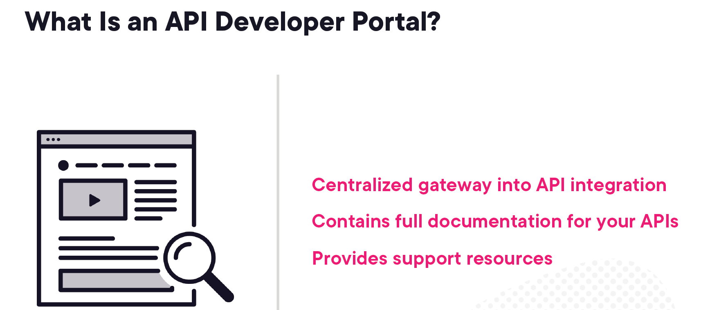
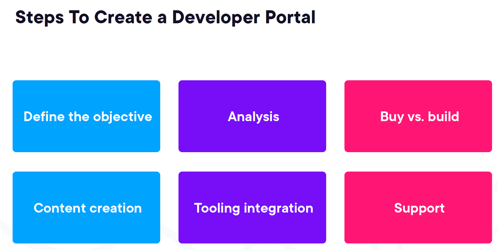
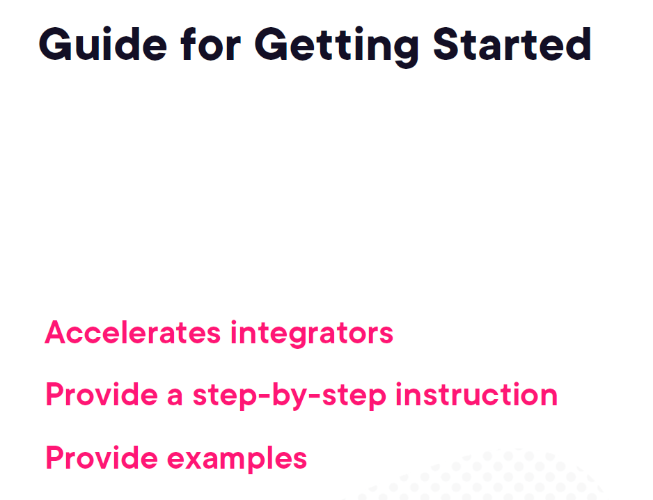
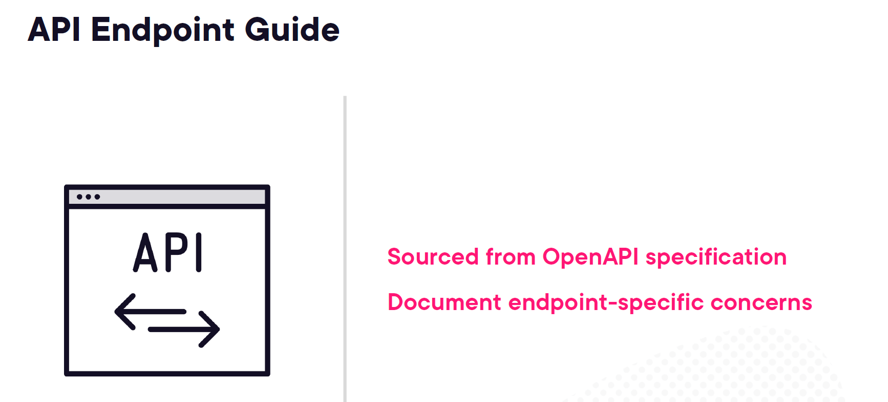
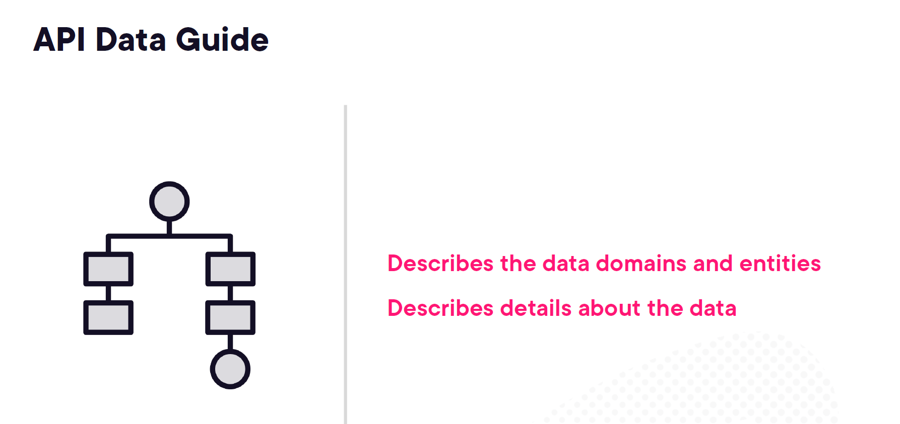
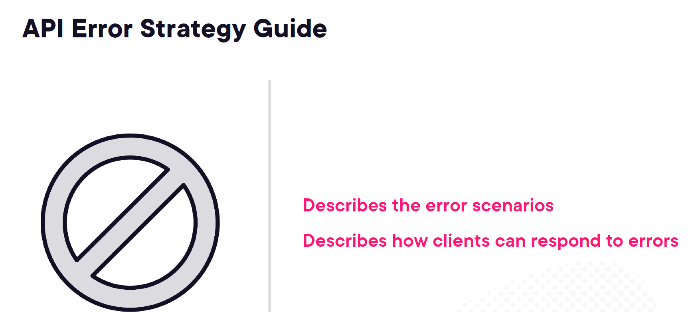
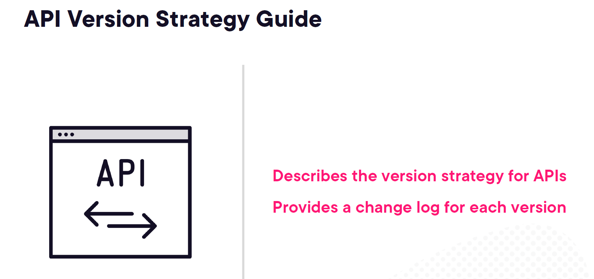
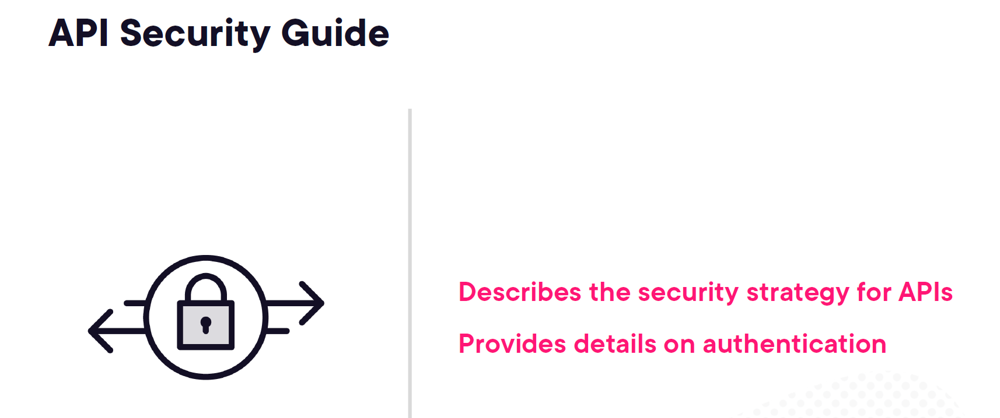
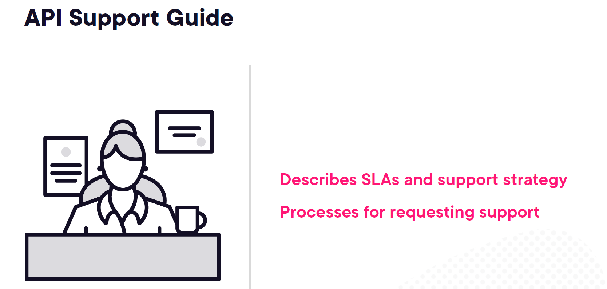
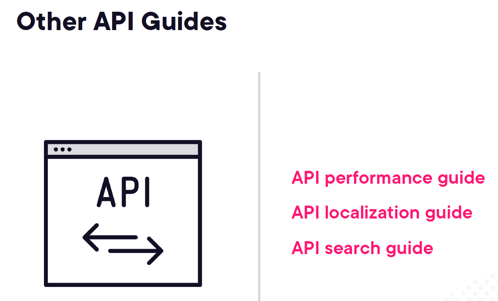

# 5. Creating a Developer Portal

## 1. Getting Started with an API Developer Portal


## 2. Creating Content for a Developer Portal








## 3. Course Conclusion

[main](../../../code/carved-rock-fitness-openapi-spec/openapi.yaml)

Absolutely! Let's delve deeply into your OpenAPI 3.1.0 specification for the **Carved Rock Fitness API**. We'll break down each section, explain its purpose, and provide practical examples to illustrate how each part functions within the API ecosystem.

---

## **Table of Contents**

1. [Overview of OpenAPI 3.1.0](#1-overview-of-openapi-3110)
2. [Top-Level Fields](#2-top-level-fields)
   - [openapi](#openapi)
   - [info](#info)
   - [servers](#servers)
   - [tags](#tags)
   - [security](#security)
   - [paths](#paths)
3. [Paths Object](#3-paths-object)
   - [Endpoint Structure](#endpoint-structure)
   - [HTTP Methods](#http-methods)
   - [Operation Object](#operation-object)
4. [Components Object](#4-components-object)
   - [Schemas](#schemas)
   - [Responses](#responses)
   - [Parameters](#parameters)
5. [Security Schemes](#5-security-schemes)
6. [Practical Examples](#6-practical-examples)
   - [Registering a New Customer](#registering-a-new-customer)
   - [Fetching a List of Products](#fetching-a-list-of-products)
   - [Updating a Workout](#updating-a-workout)
7. [Validation and Tools](#7-validation-and-tools)
8. [Best Practices and Recommendations](#8-best-practices-and-recommendations)
9. [Conclusion](#9-conclusion)

---

## 1. **Overview of OpenAPI 3.1.0**

**OpenAPI Specification (OAS)** is a standard, language-agnostic interface to RESTful APIs which allows both humans and computers to discover and understand the capabilities of the service without access to source code, documentation, or network traffic inspection.

**Version 3.1.0** introduces several improvements, including better support for webhooks, JSON Schema alignment, and enhanced security schemes.

Your YAML specification adheres to OpenAPI 3.1.0, enabling you to define the structure, endpoints, and behaviors of your **Carved Rock Fitness API** comprehensively.

---

## 2. **Top-Level Fields**

Let's examine each top-level field in your specification.

### **a. `openapi`**

```yaml
openapi: "3.1.0"
```

- **Purpose**: Specifies the version of the OpenAPI Specification that the document adheres to.
- **Importance**: Ensures that tools interpreting the specification apply the correct rules and features.

### **b. `info`**

```yaml
info:
  title: Carved Rock Fitness API
  summary: API endpoints for Carved Rock Fitness
  description: API endpoints for Carved Rock Fitness, a retailer that sells fitness merchandise.
  version: 1.0.0
  termsOfService: https://www.pluralsight.com/terms
  contact:
    name: Carved Rock Fitness
    email: mike@michaelhoffmaninc.com
    url: https://www.pluralsight.com
  license:
    name: GNU GPLv3
    url: https://www.gnu.org/licenses/gpl-3.0.html
```

- **Fields**:
  - **`title`**: The name of the API.
  - **`summary`**: A brief overview of the API's purpose.
  - **`description`**: A detailed explanation of the API, which can include usage instructions, features, and more.
  - **`version`**: The current version of the API, useful for versioning and tracking changes.
  - **`termsOfService`**: A URL pointing to the Terms of Service for the API.
  - **`contact`**: Contact information for the API maintainers.
    - **`name`**: Name of the contact person or organization.
    - **`email`**: Contact email.
    - **`url`**: Contact URL or website.
  - **`license`**: Information about the API's licensing.
    - **`name`**: Name of the license.
    - **`url`**: URL to the full license text.

- **Example Interpretation**:
  - Your API is titled **Carved Rock Fitness API**, currently at version **1.0.0**, and is licensed under **GNU GPLv3**. Users can refer to the specified **Terms of Service** and contact **Carved Rock Fitness** via the provided email or website.

### **c. `servers`**

```yaml
servers:
  - url: http://localhost:8080/api
    description: The local server
  - url: https://dev.carvedrockfitness.com/api
    description: The development server
  - url: https://test.carvedrockfitness.com/api
    description: The test server
  - url: https://carvedrockfitness.com/api
    description: The production server
```

- **Purpose**: Specifies the base URLs for the API servers where the API is hosted.
- **Fields**:
  - **`url`**: The base URL for server requests.
  - **`description`**: A human-readable description of the server.

- **Example Interpretation**:
  - Your API can be accessed locally at `http://localhost:8080/api` for development purposes. There are separate environments for **development**, **testing**, and **production**, each with its unique URL.

### **d. `tags`**

```yaml
tags:
  - name: Customers
    description: Operations related to customers
  - name: Products
    description: Operations related to products
  - name: Workouts
    description: Operations related to workouts
```

- **Purpose**: Categorizes the API endpoints for better organization and readability.
- **Fields**:
  - **`name`**: The name of the tag.
  - **`description`**: A brief description of what the tag encompasses.

- **Example Interpretation**:
  - Endpoints are grouped under **Customers**, **Products**, and **Workouts**, each handling respective operations related to their domain.

### **e. `security`**

```yaml
security:
  - bearerAuth: []
```

- **Purpose**: Defines the global security requirements that apply to all operations unless overridden.
- **Structure**:
  - Each item is a security requirement object.
  - **`bearerAuth`**: References a security scheme defined in the `components` section.
  - The empty array `[]` indicates that no specific scopes are required (relevant for OAuth2).

- **Example Interpretation**:
  - All API operations require **bearer authentication** (typically JWT tokens) unless specified otherwise.

---

## 3. **Paths Object**

The `paths` object defines the available API endpoints and their operations.

```yaml
paths:
  /customers:
    get:
      # Details...
    put:
      # Details...
    post:
      # Details...
  /customers/{customerId}:
    get:
      # Details...
    delete:
      # Details...
  /products:
    get:
      # Details...
    put:
      # Details...
    post:
      # Details...
  /products/{productId}:
    get:
      # Details...
    delete:
      # Details...
  /workouts:
    get:
      # Details...
    put:
      # Details...
    post:
      # Details...
  /workouts/{workoutId}:
    get:
      # Details...
    delete:
      # Details...
```

### **a. Endpoint Structure**

- **Base Paths**:
  - **`/customers`**: Operations related to managing multiple customers.
  - **`/customers/{customerId}`**: Operations on a specific customer identified by `customerId`.
  - **`/products`**: Operations related to managing multiple products.
  - **`/products/{productId}`**: Operations on a specific product identified by `productId`.
  - **`/workouts`**: Operations related to managing multiple workouts.
  - **`/workouts/{workoutId}`**: Operations on a specific workout identified by `workoutId`.

### **b. HTTP Methods and Operations**

Each path can support multiple HTTP methods (operations) like `GET`, `POST`, `PUT`, `DELETE`, etc. Let's explore each method within these paths.

#### **i. `/customers` Endpoint**

##### **GET /customers**

```yaml
get:
  tags:
    - Customers
  summary: Get a list of customers
  description: Get a list of customers with optional query parameters to filter the result list
  operationId: getCustomers
  parameters:
    - $ref: '#/components/parameters/CustomerFirstNameQueryParameter'
    - $ref: '#/components/parameters/CustomerLastNameQueryParameter'
    - $ref: '#/components/parameters/CustomerEmailQueryParameter'
  responses:
    '200':
      description: A list of customers
      content:
        application/json:
          schema:
            type: array
            items:
              $ref: '#/components/schemas/Customer'
    '403':
      $ref: '#/components/responses/ForbiddenResponse'
```

- **Purpose**: Retrieve a list of customers, potentially filtered by query parameters.
- **Parameters**:
  - **`firstName`**: Filter by the customer's first name.
  - **`lastName`**: Filter by the customer's last name.
  - **`email`**: Filter by the customer's email address.
  
  These parameters are referenced from the `components/parameters` section for reusability.

- **Responses**:
  - **`200 OK`**: Returns an array of `Customer` objects in JSON format.
  - **`403 Forbidden`**: Indicates that the user lacks the necessary permissions.

##### **PUT /customers**

```yaml
put:
  tags:
    - Customers
  summary: Update a customer
  description: Update a customer using the customer values passed in the request body
  operationId: updateCustomer
  requestBody:
    required: true
    content:
      application/json:
        schema:
          $ref: '#/components/schemas/Customer'
  responses:
    '200':
      description: Customer updated
      content:
        application/json:
          schema:
            type: object
            properties:
              message:
                type: string
                example: Customer updated
    '403':
      $ref: '#/components/responses/ForbiddenResponse'
    '409':
      $ref: '#/components/responses/ConflictResponse'
```

- **Purpose**: Update an existing customer's information.
- **Request Body**:
  - **Content Type**: `application/json`
  - **Schema**: `Customer` object (including `id` to identify which customer to update).
  - **Required**: `true` (must provide customer data).
  
- **Responses**:
  - **`200 OK`**: Indicates successful update with a message.
  - **`403 Forbidden`**: User lacks permission to perform the update.
  - **`409 Conflict`**: Indicates a conflict, such as attempting to update to an email that's already in use.

##### **POST /customers**

```yaml
post:
  tags:
    - Customers
  summary: Add a new customer
  description: Add a new customer using the customer values passed in the request body
  operationId: addCustomer
  requestBody:
    required: true
    content:
      application/json:
        schema:
          $ref: '#/components/schemas/CustomerInput'
  responses:
    '201':
      description: Customer added
      content:
        application/json:
          schema:
            type: object
            properties:
              message:
                type: string
                example: Customer added
    '403':
      $ref: '#/components/responses/ForbiddenResponse'
```

- **Purpose**: Create a new customer.
- **Request Body**:
  - **Content Type**: `application/json`
  - **Schema**: `CustomerInput` object (input data without the `id`).
  - **Required**: `true`
  
- **Responses**:
  - **`201 Created`**: Indicates successful creation with a message.
  - **`403 Forbidden`**: User lacks permission to create a new customer.

#### **ii. `/customers/{customerId}` Endpoint**

##### **GET /customers/{customerId}**

```yaml
get:
  tags:
    - Customers
  summary: Get a customer by ID
  description: Get a customer by ID
  operationId: getCustomerById
  parameters:
    - $ref: '#/components/parameters/CustomerIdPathParameter'
  responses:
    '200':
      description: A customer
      content:
        application/json:
          schema:
            $ref: '#/components/schemas/Customer'
    '403':
      $ref: '#/components/responses/ForbiddenResponse'
    '404':
      $ref: '#/components/responses/NotFoundResponse'
```

- **Purpose**: Retrieve a specific customer by their unique identifier.
- **Parameters**:
  - **`customerId`**: Path parameter to identify the customer.
  
- **Responses**:
  - **`200 OK`**: Returns the `Customer` object.
  - **`403 Forbidden`**: User lacks permission to access the customer data.
  - **`404 Not Found`**: Customer with the specified ID does not exist.

##### **DELETE /customers/{customerId}**

```yaml
delete:
  tags:
    - Customers
  summary: Delete a customer
  description: Delete a customer by ID
  operationId: deleteCustomer
  parameters:
    - $ref: '#/components/parameters/CustomerIdPathParameter'
  responses:
    '200':
      description: Customer deleted
      content:
        application/json:
          schema:
            type: object
            properties:
              message:
                type: string
                example: Customer deleted
    '403':
      $ref: '#/components/responses/ForbiddenResponse'
    '404':
      $ref: '#/components/responses/NotFoundResponse'
```

- **Purpose**: Remove a specific customer from the system.
- **Parameters**:
  - **`customerId`**: Path parameter to identify the customer.
  
- **Responses**:
  - **`200 OK`**: Indicates successful deletion with a message.
  - **`403 Forbidden`**: User lacks permission to delete the customer.
  - **`404 Not Found`**: Customer with the specified ID does not exist.

#### **iii. `/products` Endpoint**

##### **GET /products**

```yaml
get:
  tags:
    - Products
  summary: Get a list of products
  description: Get a list of products with optional query parameters to filter the result list
  operationId: getProducts
  parameters:
    - $ref: '#/components/parameters/ProductNameQueryParameter'
    - $ref: '#/components/parameters/ProductCategoryQueryParameter'
    - $ref: '#/components/parameters/ProductBrandQueryParameter'
    - $ref: '#/components/parameters/ProductColorQueryParameter'
    - $ref: '#/components/parameters/ProductSizeQueryParameter'
    - $ref: '#/components/parameters/ProductWeightQueryParameter'
    - $ref: '#/components/parameters/ProductDimensionsQueryParameter'
    - $ref: '#/components/parameters/ProductSkuQueryParameter'
    - $ref: '#/components/parameters/ProductUpcQueryParameter'
  responses:
    '200':
      description: A list of products
      content:
        application/json:
          schema:
            type: array
            items:
              $ref: '#/components/schemas/Product'
    '403':
      $ref: '#/components/responses/ForbiddenResponse'
```

- **Purpose**: Retrieve a list of products, potentially filtered by various attributes.
- **Parameters**:
  - **`productName`**, **`category`**, **`brand`**, **`color`**, **`size`**, **`weight`**, **`dimensions`**, **`sku`**, **`upc`**: Query parameters for filtering products based on these attributes.
  
- **Responses**:
  - **`200 OK`**: Returns an array of `Product` objects.
  - **`403 Forbidden`**: User lacks permission to access product data.

##### **PUT /products**

```yaml
put:
  tags:
    - Products
  summary: Update a product
  description: Update a product using the product values passed in the request body
  operationId: updateProduct
  requestBody:
    required: true
    content:
      application/json:
        schema:
          $ref: '#/components/schemas/Product'
  responses:
    '200':
      description: Product updated
      content:
        application/json:
          schema:
            type: object
            properties:
              message:
                type: string
                example: Product updated
    '403':
      $ref: '#/components/responses/ForbiddenResponse'
    '409':
      $ref: '#/components/responses/ConflictResponse'
```

- **Purpose**: Update an existing product's information.
- **Request Body**:
  - **Content Type**: `application/json`
  - **Schema**: `Product` object (includes `id`).
  - **Required**: `true`
  
- **Responses**:
  - **`200 OK`**: Indicates successful update with a message.
  - **`403 Forbidden`**: User lacks permission to update the product.
  - **`409 Conflict`**: Indicates a conflict, such as updating to a SKU that's already in use.

##### **POST /products**

```yaml
post:
  tags:
    - Products
  summary: Add a new product
  description: Add a new product using the product values passed in the request body
  operationId: addProduct
  requestBody:
    required: true
    content:
      application/json:
        schema:
          $ref: '#/components/schemas/ProductInput'
  responses:
    '201':
      description: Product added
      content:
        application/json:
          schema:
            type: object
            properties:
              message:
                type: string
                example: Product added
    '403':
      $ref: '#/components/responses/ForbiddenResponse'
```

- **Purpose**: Create a new product.
- **Request Body**:
  - **Content Type**: `application/json`
  - **Schema**: `ProductInput` object (input data without `id`).
  - **Required**: `true`
  
- **Responses**:
  - **`201 Created`**: Indicates successful creation with a message.
  - **`403 Forbidden`**: User lacks permission to create a new product.

#### **iv. `/products/{productId}` Endpoint**

##### **GET /products/{productId}**

```yaml
get:
  tags:
    - Products
  summary: Get a product by ID
  description: Get a product by ID
  operationId: getProductById
  parameters:
    - $ref: '#/components/parameters/ProductIdPathParameter'
  responses:
    '200':
      description: A product
      content:
        application/json:
          schema:
            $ref: '#/components/schemas/Product'
    '403':
      $ref: '#/components/responses/ForbiddenResponse'
    '404':
      $ref: '#/components/responses/NotFoundResponse'
```

- **Purpose**: Retrieve a specific product by its unique identifier.
- **Parameters**:
  - **`productId`**: Path parameter to identify the product.
  
- **Responses**:
  - **`200 OK`**: Returns the `Product` object.
  - **`403 Forbidden`**: User lacks permission to access the product data.
  - **`404 Not Found`**: Product with the specified ID does not exist.

##### **DELETE /products/{productId}**

```yaml
delete:
  tags:
    - Products
  summary: Delete a product
  description: Delete a product by ID
  operationId: deleteProduct
  parameters:
    - $ref: '#/components/parameters/ProductIdPathParameter'
  responses:
    '200':
      description: Product deleted
      content:
        application/json:
          schema:
            type: object
            properties:
              message:
                type: string
                example: Product deleted
    '403':
      $ref: '#/components/responses/ForbiddenResponse'
    '404':
      $ref: '#/components/responses/NotFoundResponse'
```

- **Purpose**: Remove a specific product from the system.
- **Parameters**:
  - **`productId`**: Path parameter to identify the product.
  
- **Responses**:
  - **`200 OK`**: Indicates successful deletion with a message.
  - **`403 Forbidden`**: User lacks permission to delete the product.
  - **`404 Not Found`**: Product with the specified ID does not exist.

#### **v. `/workouts` Endpoint**

##### **GET /workouts**

```yaml
get:
  tags:
    - Workouts
  summary: Get a list of workouts
  description: Get a list of workouts with optional query parameters to filter the result list
  operationId: getWorkouts
  parameters:
    - $ref: '#/components/parameters/WorkoutNameQueryParameter'
    - $ref: '#/components/parameters/WorkoutTypeQueryParameter'
    - $ref: '#/components/parameters/WorkoutDurationQueryParameter'
    - $ref: '#/components/parameters/WorkoutIntensityQueryParameter'
    - $ref: '#/components/parameters/WorkoutEquipmentNeededQueryParameter'
    - $ref: '#/components/parameters/WorkoutTargetMuscleGroupQueryParameter'
    - $ref: '#/components/parameters/WorkoutCaloriesBurnedQueryParameter'
  responses:
    '200':
      description: A list of workouts
      content:
        application/json:
          schema:
            type: array
            items:
              $ref: '#/components/schemas/Workout'
    '403':
      $ref: '#/components/responses/ForbiddenResponse'
```

- **Purpose**: Retrieve a list of workouts, potentially filtered by various attributes.
- **Parameters**:
  - **`name`**, **`type`**, **`duration`**, **`intensity`**, **`equipmentNeeded`**, **`targetMuscleGroup`**, **`caloriesBurned`**: Query parameters for filtering workouts based on these attributes.
  
- **Responses**:
  - **`200 OK`**: Returns an array of `Workout` objects.
  - **`403 Forbidden`**: User lacks permission to access workout data.

##### **PUT /workouts**

```yaml
put:
  tags:
    - Workouts
  summary: Update a workout
  description: Update a workout using the workout values passed in the request body
  operationId: updateWorkout
  requestBody:
    required: true
    content:
      application/json:
        schema:
          $ref: '#/components/schemas/Workout'
  responses:
    '200':
      description: Workout updated
      content:
        application/json:
          schema:
            type: object
            properties:
              message:
                type: string
                example: Workout updated
    '403':
      $ref: '#/components/responses/ForbiddenResponse'
    '409':
      $ref: '#/components/responses/ConflictResponse'
```

- **Purpose**: Update an existing workout's information.
- **Request Body**:
  - **Content Type**: `application/json`
  - **Schema**: `Workout` object (includes `id`).
  - **Required**: `true`
  
- **Responses**:
  - **`200 OK`**: Indicates successful update with a message.
  - **`403 Forbidden`**: User lacks permission to update the workout.
  - **`409 Conflict`**: Indicates a conflict, such as attempting to update to a workout name that's already in use.

##### **POST /workouts**

```yaml
post:
  tags:
    - Workouts
  summary: Add a new workout
  description: Add a new workout using the workout values passed in the request body
  operationId: addWorkout
  requestBody:
    required: true
    content:
      application/json:
        schema:
          $ref: '#/components/schemas/WorkoutInput'
  responses:
    '201':
      description: Workout added
      content:
        application/json:
          schema:
            type: object
            properties:
              message:
                type: string
                example: Workout added
    '403':
      $ref: '#/components/responses/ForbiddenResponse'
```

- **Purpose**: Create a new workout.
- **Request Body**:
  - **Content Type**: `application/json`
  - **Schema**: `WorkoutInput` object (input data without `id`).
  - **Required**: `true`
  
- **Responses**:
  - **`201 Created`**: Indicates successful creation with a message.
  - **`403 Forbidden`**: User lacks permission to create a new workout.

#### **vi. `/workouts/{workoutId}` Endpoint**

##### **GET /workouts/{workoutId}**

```yaml
get:
  tags:
    - Workouts
  summary: Get a workout by ID
  description: Get a workout by ID
  operationId: getWorkoutById
  parameters:
    - $ref: '#/components/parameters/WorkoutIdPathParameter'
  responses:
    '200':
      description: A workout
      content:
        application/json:
          schema:
            $ref: '#/components/schemas/Workout'
    '403':
      $ref: '#/components/responses/ForbiddenResponse'
    '404':
      $ref: '#/components/responses/NotFoundResponse'
```

- **Purpose**: Retrieve a specific workout by its unique identifier.
- **Parameters**:
  - **`workoutId`**: Path parameter to identify the workout.
  
- **Responses**:
  - **`200 OK`**: Returns the `Workout` object.
  - **`403 Forbidden`**: User lacks permission to access the workout data.
  - **`404 Not Found`**: Workout with the specified ID does not exist.

##### **DELETE /workouts/{workoutId}**

```yaml
delete:
  tags:
    - Workouts
  summary: Delete a workout
  description: Delete a workout by ID
  operationId: deleteWorkout
  parameters:
    - $ref: '#/components/parameters/WorkoutIdPathParameter'
  responses:
    '200':
      description: Workout deleted
      content:
        application/json:
          schema:
            type: object
            properties:
              message:
                type: string
                example: Workout deleted
    '403':
      $ref: '#/components/responses/ForbiddenResponse'
    '404':
      $ref: '#/components/responses/NotFoundResponse'
```

- **Purpose**: Remove a specific workout from the system.
- **Parameters**:
  - **`workoutId`**: Path parameter to identify the workout.
  
- **Responses**:
  - **`200 OK`**: Indicates successful deletion with a message.
  - **`403 Forbidden`**: User lacks permission to delete the workout.
  - **`404 Not Found`**: Workout with the specified ID does not exist.

---

## 4. **Components Object**

The `components` section allows you to define reusable components such as schemas, responses, parameters, and security schemes.

```yaml
components:
  schemas:
    # Schema definitions...
  responses:
    # Response definitions...
  parameters:
    # Parameter definitions...
```

### **a. Schemas**

Schemas define the structure of the data models used in your API.

#### **i. `CustomerInput` Schema**

```yaml
CustomerInput:
  type: object
  properties:
    firstName:
      type: string
    lastName:
      type: string
    email:
      type: string
    phone:
      type: string
    address:
      type: string
    city:
      type: string
    state:
      type: string
    country:
      type: string
    zipCode:
      type: string
    dateOfBirth:
      type: string
      format: date
    gender:
      type: string
    createdAt:
      type: string
      format: date-time
    updatedAt:
      type: string
      format: date-time
    isActive:
      type: boolean
  required:
    - firstName
    - lastName
    - email
```

- **Purpose**: Represents the data required to create a new customer.
- **Properties**:
  - **`firstName`**, **`lastName`**, **`email`**, etc.: Various attributes of a customer.
  - **`createdAt`**, **`updatedAt`**: Timestamps for record creation and updates.
  - **`isActive`**: Indicates whether the customer is active.
  
- **Required Fields**:
  - **`firstName`**, **`lastName`**, **`email`**: These fields must be provided when creating a customer.

#### **ii. `Customer` Schema**

```yaml
Customer:
  allOf:
    - $ref: '#/components/schemas/CustomerInput'
    - type: object
      properties:
        id:
          type: integer
          format: int64
      required:
        - id
```

- **Purpose**: Extends `CustomerInput` by adding an `id` field, representing a customer retrieved from the system.
- **Structure**:
  - **`allOf`**: Combines multiple schemas into one.
  - **`$ref: '#/components/schemas/CustomerInput'`**: Includes all properties from `CustomerInput`.
  - **Additional Property**:
    - **`id`**: Unique identifier for the customer.
  
- **Required Fields**:
  - **`id`**: Must be present, as it uniquely identifies the customer.

#### **iii. `ProductInput` Schema**

```yaml
ProductInput:
  type: object
  properties:
    name:
      type: string
    description:
      type: string
    price:
      type: number
      format: float
    currency:
      type: string
    stock:
      type: integer
      format: int32
    category:
      type: string
    brand:
      type: string
    color:
      type: string
    size:
      type: string
    weight:
      type: number
      format: float
    dimensions:
      type: string
    sku:
      type: string
    upc:
      type: string
    image_url:
      type: string
  required:
    - name
    - category
    - brand
    - sku
```

- **Purpose**: Represents the data required to create a new product.
- **Properties**:
  - **`name`**, **`description`**, **`price`**, **`currency`**, etc.: Various attributes of a product.
  
- **Required Fields**:
  - **`name`**, **`category`**, **`brand`**, **`sku`**: Must be provided when creating a product.

#### **iv. `Product` Schema**

```yaml
Product:
  allOf:
    - $ref: '#/components/schemas/ProductInput'
    - type: object
      properties:
        id:
          type: integer
          format: int64
      required:
        - id
```

- **Purpose**: Extends `ProductInput` by adding an `id` field, representing a product retrieved from the system.
- **Structure**:
  - **`allOf`**: Combines multiple schemas into one.
  - **`$ref: '#/components/schemas/ProductInput'`**: Includes all properties from `ProductInput`.
  - **Additional Property**:
    - **`id`**: Unique identifier for the product.
  
- **Required Fields**:
  - **`id`**: Must be present, as it uniquely identifies the product.

#### **v. `WorkoutInput` Schema**

```yaml
WorkoutInput:
  type: object
  properties:
    name:
      type: string
    description:
      type: string
    type:
      type: string
    duration:
      type: integer
      format: int32
    intensity:
      type: string
    equipmentNeeded:
      type: string
    targetMuscleGroup:
      type: string
    caloriesBurned:
      type: integer
      format: int32
    videoUrl:
      type: string
    imageUrl:
      type: string
    createdAt:
      type: string
      format: date-time
    updatedAt:
      type: string
      format: date-time
    isActive:
      type: boolean
  required:
    - name
    - type
    - duration
    - intensity
```

- **Purpose**: Represents the data required to create a new workout.
- **Properties**:
  - **`name`**, **`description`**, **`type`**, **`duration`**, **`intensity`**, etc.: Various attributes of a workout.
  
- **Required Fields**:
  - **`name`**, **`type`**, **`duration`**, **`intensity`**: Must be provided when creating a workout.

#### **vi. `Workout` Schema**

```yaml
Workout:
  allOf:
    - $ref: '#/components/schemas/WorkoutInput'
    - type: object
      properties:
        id:
          type: integer
          format: int64
      required:
        - id
```

- **Purpose**: Extends `WorkoutInput` by adding an `id` field, representing a workout retrieved from the system.
- **Structure**:
  - **`allOf`**: Combines multiple schemas into one.
  - **`$ref: '#/components/schemas/WorkoutInput'`**: Includes all properties from `WorkoutInput`.
  - **Additional Property**:
    - **`id`**: Unique identifier for the workout.
  
- **Required Fields**:
  - **`id`**: Must be present, as it uniquely identifies the workout.

### **b. Responses**

Standardizes responses to various HTTP status codes, promoting reusability and consistency across the API.

#### **i. `BadRequestResponse`**

```yaml
BadRequestResponse:
  description: The request could not be understood by the server due to malformed syntax
  content:
    application/json:
      example:
        message: Bad request
        status: 400
        error: Bad request
```

- **Purpose**: Represents a `400 Bad Request` response.
- **Content**:
  - **`application/json`**: The response body is in JSON format.
  - **`example`**: Provides a sample response for documentation purposes.

#### **ii. `ConflictResponse`**

```yaml
ConflictResponse:
  description: The request could not be completed due to a conflict with the current state of the resource
  content:
    application/json:
      example:
        message: Conflict
        status: 409
        error: Conflict
```

- **Purpose**: Represents a `409 Conflict` response.
- **Usage**: Typically used when attempting to create or update a resource that conflicts with existing data (e.g., duplicate SKU).

#### **iii. `ForbiddenResponse`**

```yaml
ForbiddenResponse:
  description: User does not have permission to access the resource or data
  content:
    application/json:
      example:
        message: Forbidden request
        status: 403
        error: Forbidden
```

- **Purpose**: Represents a `403 Forbidden` response.
- **Usage**: Indicates that the authenticated user does not have the necessary permissions to perform the action.

#### **iv. `InternalServerErrorResponse`**

```yaml
InternalServerErrorResponse:
  description: The server has encountered a situation it doesn't know how to handle
  content:
    application/json:
      example:
        message: Internal server error
        status: 500
        error: Internal server error
```

- **Purpose**: Represents a `500 Internal Server Error` response.
- **Usage**: Indicates that an unexpected error occurred on the server side.

#### **v. `NotFoundResponse`**

```yaml
NotFoundResponse:
  description: The requested resource could not be found
  content:
    application/json:
      example:
        message: Not found
        status: 404
        error: Not found
```

- **Purpose**: Represents a `404 Not Found` response.
- **Usage**: Indicates that the requested resource does not exist (e.g., non-existent `customerId`).

#### **vi. `UnauthorizedResponse`**

```yaml
UnauthorizedResponse:
  description: The request has not been applied because it lacks valid authentication credentials for the target resource
  content:
    application/json:
      example:
        message: Unauthorized request
        status: 401
        error: Unauthorized
```

- **Purpose**: Represents a `401 Unauthorized` response.
- **Usage**: Indicates that authentication is required and has failed or has not yet been provided.

### **c. Parameters**

Parameters define reusable components for query, path, header, or cookie parameters.

#### **i. Customer Query Parameters**

##### **`CustomerFirstNameQueryParameter`**

```yaml
CustomerFirstNameQueryParameter:
  name: firstName
  in: query
  description: The first name of the customer
  schema:
    type: string
    example: "Michael"
```

- **Purpose**: Allows filtering customers by their first name.
- **Location**: Query string.
- **Example Usage**:
  ```
  GET /customers?firstName=Michael
  ```

##### **`CustomerLastNameQueryParameter`**

```yaml
CustomerLastNameQueryParameter:
  name: lastName
  in: query
  description: The last name of the customer
  schema:
    type: string
    example: "Hoffman"
```

- **Purpose**: Allows filtering customers by their last name.
- **Example Usage**:
  ```
  GET /customers?lastName=Hoffman
  ```

##### **`CustomerEmailQueryParameter`**

```yaml
CustomerEmailQueryParameter:
  name: email
  in: query
  description: The email address of the customer
  schema:
    type: string
    example: "mike@michaelhoffmaninc.com"
```

- **Purpose**: Allows filtering customers by their email address.
- **Example Usage**:
  ```
  GET /customers?email=mike@michaelhoffmaninc.com
  ```

#### **ii. Customer Path Parameter**

##### **`CustomerIdPathParameter`**

```yaml
CustomerIdPathParameter:
  name: customerId
  in: path
  description: The ID of the customer
  required: true
  schema:
    type: integer
    format: int64
    example: 12345
```

- **Purpose**: Identifies a specific customer by their unique ID.
- **Location**: Path segment.
- **Usage**:
  ```
  GET /customers/12345
  DELETE /customers/12345
  ```

#### **iii. Product Query Parameters**

Similarly, various query parameters are defined for products to filter based on different attributes like `productName`, `category`, `brand`, etc.

##### **Example: `ProductNameQueryParameter`**

```yaml
ProductNameQueryParameter:
  name: productName
  in: query
  description: The name of the product
  schema:
    type: string
    example: "Treadmill"
```

- **Usage**:
  ```
  GET /products?productName=Treadmill
  ```

#### **iv. Product Path Parameter**

##### **`ProductIdPathParameter`**

```yaml
ProductIdPathParameter:
  name: productId
  in: path
  description: The ID of the product
  required: true
  schema:
    type: integer
    format: int64
    example: 12345
```

- **Purpose**: Identifies a specific product by its unique ID.
- **Usage**:
  ```
  GET /products/12345
  DELETE /products/12345
  ```

#### **v. Workout Query Parameters**

Similarly, workout-specific query parameters allow filtering workouts based on attributes like `name`, `type`, `duration`, etc.

##### **Example: `WorkoutTypeQueryParameter`**

```yaml
WorkoutTypeQueryParameter:
  name: type
  in: query
  description: The type of the workout
  schema:
    type: string
    example: "Cardio"
```

- **Usage**:
  ```
  GET /workouts?type=Cardio
  ```

#### **vi. Workout Path Parameter**

##### **`WorkoutIdPathParameter`**

```yaml
WorkoutIdPathParameter:
  name: workoutId
  in: path
  description: The ID of the workout
  required: true
  schema:
    type: integer
    format: int64
    example: 12345
```

- **Purpose**: Identifies a specific workout by its unique ID.
- **Usage**:
  ```
  GET /workouts/12345
  DELETE /workouts/12345
  ```

---

## 5. **Security Schemes**

While the `security` field in the top-level defines `bearerAuth`, it's essential to define this security scheme within `components/securitySchemes`. However, it's missing in your provided YAML. Let's assume it's defined elsewhere or needs to be added.

### **Defining `bearerAuth` Security Scheme**

```yaml
components:
  securitySchemes:
    bearerAuth:
      type: http
      scheme: bearer
      bearerFormat: JWT
```

- **Purpose**: Defines a security scheme named `bearerAuth` using HTTP Bearer authentication with JWT tokens.
- **Fields**:
  - **`type: http`**: Specifies the type of security scheme.
  - **`scheme: bearer`**: Uses the Bearer scheme.
  - **`bearerFormat: JWT`**: Indicates that the bearer tokens are JWTs.

### **Incorporating into `security`**

With the above definition, the global `security` requirement:

```yaml
security:
  - bearerAuth: []
```

Means that all endpoints require a valid JWT token unless overridden.

---

## 6. **Practical Examples**

Let's walk through some practical examples to see how your OpenAPI specification translates into actual API usage.

### **a. Registering a New Customer**

#### **Endpoint**

```
POST /customers
```

#### **Request Body**

```json
{
    "firstName": "Alice",
    "lastName": "Wonderland",
    "email": "alice@example.com",
    "phone": "123-456-7890",
    "address": "123 Fitness St.",
    "city": "Fitville",
    "state": "ActiveState",
    "country": "FitnessLand",
    "zipCode": "12345",
    "dateOfBirth": "1990-01-01",
    "gender": "Female",
    "createdAt": "2024-04-27T12:34:56Z",
    "updatedAt": "2024-04-27T12:34:56Z",
    "isActive": true
}
```

- **Schema**: `CustomerInput`
- **Required Fields**: `firstName`, `lastName`, `email`
- **Optional Fields**: `phone`, `address`, etc.

#### **Response**

**Status Code**: `201 Created`

```json
{
    "message": "Customer added"
}
```

- **Explanation**: Confirms the successful creation of a new customer.

#### **Error Scenario**

**Status Code**: `403 Forbidden`

```json
{
    "message": "Forbidden request",
    "status": 403,
    "error": "Forbidden"
}
```

- **Explanation**: The user attempting to create a customer lacks the necessary permissions.

### **b. Fetching a List of Products with Filters**

#### **Endpoint**

```
GET /products?productName=Treadmill&category=Fitness%20Equipment&brand=NordicTrack
```

#### **Query Parameters**

- **`productName`**: `"Treadmill"`
- **`category`**: `"Fitness Equipment"`
- **`brand`**: `"NordicTrack"`

#### **Response**

**Status Code**: `200 OK`

```json
[
    {
        "id": 1,
        "name": "NordicTrack Treadmill",
        "description": "High-quality treadmill for home use.",
        "price": 999.99,
        "currency": "USD",
        "stock": 50,
        "category": "Fitness Equipment",
        "brand": "NordicTrack",
        "color": "Black",
        "size": "Large",
        "weight": 150.5,
        "dimensions": "200x80x100",
        "sku": "NT-TM-001",
        "upc": "123456789012",
        "image_url": "https://example.com/images/treadmill.jpg"
    },
    {
        "id": 2,
        "name": "NordicTrack Advanced Treadmill",
        "description": "Advanced features with interactive training.",
        "price": 1299.99,
        "currency": "USD",
        "stock": 30,
        "category": "Fitness Equipment",
        "brand": "NordicTrack",
        "color": "White",
        "size": "Medium",
        "weight": 140.0,
        "dimensions": "180x75x95",
        "sku": "NT-TM-002",
        "upc": "123456789013",
        "image_url": "https://example.com/images/advanced_treadmill.jpg"
    }
]
```

- **Explanation**: Returns a list of products matching the specified filters. Each product includes detailed information as per the `Product` schema.

#### **Error Scenario**

**Status Code**: `403 Forbidden`

```json
{
    "message": "Forbidden request",
    "status": 403,
    "error": "Forbidden"
}
```

- **Explanation**: The user lacks permission to view the list of products.

### **c. Updating a Workout**

#### **Endpoint**

```
PUT /workouts
```

#### **Request Body**

```json
{
    "id": 101,
    "name": "Cardio Blast",
    "description": "Intense cardio session to burn calories.",
    "type": "Cardio",
    "duration": 45,
    "intensity": "High",
    "equipmentNeeded": "Treadmill",
    "targetMuscleGroup": "Legs",
    "caloriesBurned": 500,
    "videoUrl": "https://example.com/videos/cardio_blast.mp4",
    "imageUrl": "https://example.com/images/cardio_blast.jpg",
    "createdAt": "2024-04-20T10:00:00Z",
    "updatedAt": "2024-04-27T15:30:00Z",
    "isActive": true
}
```

- **Schema**: `Workout`
- **Required Fields**: `id`, `name`, `type`, `duration`, `intensity`

#### **Response**

**Status Code**: `200 OK`

```json
{
    "message": "Workout updated"
}
```

- **Explanation**: Confirms the successful update of the workout.

#### **Error Scenario**

**Status Code**: `409 Conflict`

```json
{
    "message": "Conflict",
    "status": 409,
    "error": "Conflict"
}
```

- **Explanation**: The update operation conflicts with the current state of the resource, such as trying to rename the workout to an existing name.

---

## 7. **Validation and Tools**

Ensuring that your OpenAPI specification is valid and well-structured is crucial for generating accurate documentation and client/server code.

### **a. Validation Tools**

1. **Swagger Editor**
   - **URL**: [https://editor.swagger.io/](https://editor.swagger.io/)
   - **Usage**: Paste your YAML specification to validate and visualize the API.
   - **Features**:
     - Real-time validation and error highlighting.
     - Interactive API documentation preview.

2. **OpenAPI Generator**
   - **URL**: [https://openapi-generator.tech/](https://openapi-generator.tech/)
   - **Usage**: Generate client SDKs, server stubs, and API documentation from your OpenAPI spec.
   - **Command-Line Example**:
     ```bash
     openapi-generator-cli generate -i your-api.yaml -g spring -o ./generated-spring-server
     ```

3. **SwaggerHub**
   - **URL**: [https://swagger.io/tools/swaggerhub/](https://swagger.io/tools/swaggerhub/)
   - **Usage**: Collaborative platform for designing, building, and documenting APIs.
   - **Features**:
     - Version control.
     - Team collaboration tools.

### **b. Common Validation Errors and Fixes**

1. **Missing Security Schemes**
   - **Issue**: Defined `bearerAuth` in `security` but not in `components/securitySchemes`.
   - **Fix**: Add the security scheme as previously illustrated.

2. **Schema Referencing Errors**
   - **Issue**: Referencing a schema that isn't defined.
   - **Fix**: Ensure all referenced schemas are defined under `components/schemas`.

3. **Invalid Parameter Locations**
   - **Issue**: Specifying parameters in incorrect locations (e.g., using `query` for path parameters).
   - **Fix**: Verify that each parameter is placed correctly (`query`, `path`, `header`, or `cookie`).

4. **Incorrect Response Status Codes**
   - **Issue**: Using status codes that don't align with the operation (e.g., `201 Created` for a `GET` request).
   - **Fix**: Ensure that status codes appropriately match the operation's intent.

---

## 8. **Best Practices and Recommendations**

Adhering to best practices ensures that your API is robust, secure, and user-friendly.

### **a. Use Meaningful `operationId`s**

- **Purpose**: Uniquely identifies operations for code generation and tooling.
- **Recommendation**: Use clear, descriptive names that reflect the action, such as `getCustomers`, `addProduct`, etc.

### **b. Consistent Naming Conventions**

- **Purpose**: Enhances readability and maintainability.
- **Recommendation**:
  - Use camelCase or snake_case consistently for parameter names.
  - Ensure that schema property names match the naming conventions used in your codebase.

### **c. Detailed Descriptions**

- **Purpose**: Provides clarity on the purpose and usage of endpoints, parameters, and schemas.
- **Recommendation**: Expand descriptions to include examples, edge cases, and specific behaviors.

### **d. Schema Definitions**

- **Purpose**: Centralizes data model definitions for reusability.
- **Recommendation**:
  - Use inheritance (`allOf`) to extend base schemas.
  - Define separate input and output schemas if input data differs from output (e.g., omitting `id` in input).

### **e. Security Considerations**

- **Define Security Schemes**: Ensure all security schemes are properly defined under `components/securitySchemes`.
- **Secure Sensitive Endpoints**: Use role-based access controls (RBAC) to restrict access to sensitive operations.
- **Example**:
  ```yaml
  /workouts:
    post:
      security:
        - bearerAuth:
            - admin
      # Other details...
  ```
  
### **f. Response Standardization**

- **Purpose**: Ensures consistency across API responses.
- **Recommendation**:
  - Standardize error responses with consistent structures.
  - Include helpful error messages and status codes.

### **g. Pagination and Filtering**

- **Purpose**: Enhances API performance and user experience.
- **Recommendation**:
  - Implement pagination for list endpoints using `page` and `size` query parameters.
  - Allow sorting with a `sort` parameter.
  
  **Example**:
  ```yaml
  parameters:
    - name: page
      in: query
      description: Page number for pagination
      schema:
        type: integer
        example: 1
    - name: size
      in: query
      description: Number of items per page
      schema:
        type: integer
        example: 20
    - name: sort
      in: query
      description: Sorting criteria in the format: property,order
      schema:
        type: string
        example: "name,asc"
  ```

### **h. Utilize OpenAPI Extensions**

- **Purpose**: Add custom metadata or behaviors not covered by standard OpenAPI fields.
- **Example**: Using `x-` prefixed extensions.
  
  ```yaml
  components:
    schemas:
      Customer:
        x-category: "Business Data"
        # Other fields...
  ```

### **i. Documentation and Testing**

- **Purpose**: Facilitates API understanding and ensures functionality.
- **Recommendation**:
  - Use Swagger UI or ReDoc to generate interactive documentation.
  - Implement automated tests based on the OpenAPI specification to verify endpoint behaviors.

---

## 9. **Conclusion**

Your **Carved Rock Fitness API** OpenAPI 3.1.0 specification is well-structured, covering key domains: **Customers**, **Products**, and **Workouts**. Here's a recap of the critical aspects:

- **Comprehensive Schemas**: Clearly defines input and output data models, promoting consistency.
- **Reusable Components**: Utilizes `components` for schemas, responses, and parameters, enhancing maintainability.
- **Security Integration**: Enforces bearer authentication across all endpoints, ensuring secure access.
- **Detailed Endpoints**: Each endpoint is thoroughly described with relevant parameters, request bodies, and responses.
- **Error Handling**: Standardizes error responses, aiding in client-side error management.

### **Next Steps and Recommendations**

1. **Complete Security Schemes**: Ensure that all security schemes referenced are fully defined within `components/securitySchemes`.
2. **Enhance Descriptions**: Add more detailed descriptions and examples to aid developers in understanding API functionalities.
3. **Implement Pagination and Sorting**: For endpoints returning lists, consider adding pagination and sorting capabilities to handle large datasets efficiently.
4. **Generate Interactive Documentation**: Utilize tools like Swagger UI or ReDoc to visualize and interact with your API based on the OpenAPI specification.
5. **Automate Testing**: Leverage OpenAPI-based testing tools to create automated tests ensuring your API adheres to its specification.

By following these guidelines and continuously refining your OpenAPI specification, you can develop a robust, user-friendly, and secure API that meets both business and developer needs.

Feel free to reach out if you need further assistance or specific examples related to any part of your OpenAPI specification!

[customer](../../../code/carved-rock-fitness-openapi-spec/specs/customer/openapi.yaml)

[product](../../../code/carved-rock-fitness-openapi-spec/specs/product/openapi.yaml)

[workout](../../../code/carved-rock-fitness-openapi-spec/specs/workout/openapi.yaml)